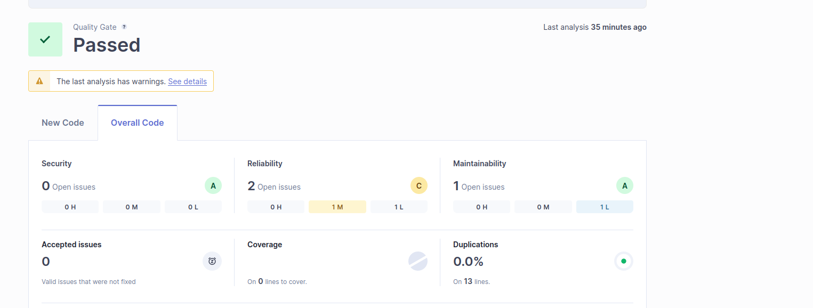
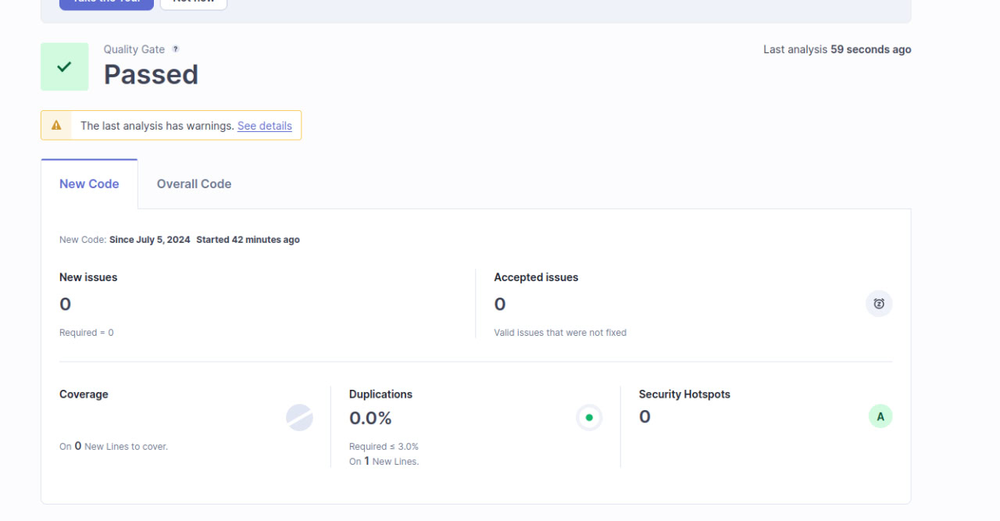

# Домашнее задание к занятию 9 «Процессы CI/CD»

## Подготовка к выполнению

1. Создайте два VM в Yandex Cloud с параметрами: 2CPU 4RAM Centos7 (остальное по минимальным требованиям).
2. Пропишите в [inventory](./infrastructure/inventory/cicd/hosts.yml) [playbook](./infrastructure/site.yml) созданные хосты.
3. Добавьте в [files](./infrastructure/files/) файл со своим публичным ключом (id_rsa.pub). Если ключ называется иначе — найдите таску в плейбуке, которая использует id_rsa.pub имя, и исправьте на своё.
4. Запустите playbook, ожидайте успешного завершения.
5. Проверьте готовность SonarQube через [браузер](http://localhost:9000).
6. Зайдите под admin\admin, поменяйте пароль на свой.
7.  Проверьте готовность Nexus через [бразуер](http://localhost:8081).
8. Подключитесь под admin\admin123, поменяйте пароль, сохраните анонимный доступ.

Запустил инфраструктуру в докере
```
docker run -d -p 8081:8081 --name nexus sonatype/nexus3
docker exec nexus cat /nexus-data/admin.password
#sonar admin\admin
docker inspect sonarqube | grep -i IPAddress
docker run --stop-timeout 3600 -d --name sonarqube -p 9000:9000 sonarqube
```

## Знакомоство с SonarQube

### Основная часть

1. Создайте новый проект, название произвольное.
2. Скачайте пакет sonar-scanner, который вам предлагает скачать SonarQube.
3. Сделайте так, чтобы binary был доступен через вызов в shell (или поменяйте переменную PATH, или любой другой, удобный вам способ).
4. Проверьте `sonar-scanner --version`.
```
docker run --rm sonarsource/sonar-scanner-cli --version
INFO: Scanner configuration file: /opt/sonar-scanner/conf/sonar-scanner.properties
INFO: Project root configuration file: NONE
INFO: SonarScanner 5.0.1.3006
INFO: Java 17.0.11 Alpine (64-bit)
INFO: Linux 6.5.0-41-generic amd64
```
5. Запустите анализатор против кода из директории [example](./example) с дополнительным ключом `-Dsonar.coverage.exclusions=fail.py`.
Команда запуска:
```
docker run --rm -e SONAR_HOST_URL="http://172.17.0.3:9000" -v "./example:/usr/src" sonarsource/sonar-scanner-cli -Dsonar.projectKey=vagrant -Dsonar.sources=. -Dsonar.token=sqp_638fa207563df88af83e2699c8ad63f45d640b5a -Dsonar.coverage.exclusions=fail.py
```
Лог:
```
INFO: Analysis total time: 6.855 s
INFO: ------------------------------------------------------------------------
INFO: EXECUTION SUCCESS
INFO: ------------------------------------------------------------------------
INFO: Total time: 9.025s
INFO: Final Memory: 18M/74M
INFO: ------------------------------------------------------------------------
```
6. Посмотрите результат в интерфейсе.

7. Исправьте ошибки, которые он выявил, включая warnings.
8. Запустите анализатор повторно — проверьте, что QG пройдены успешно.
9. Сделайте скриншот успешного прохождения анализа, приложите к решению ДЗ.


## Знакомство с Nexus

### Основная часть

1. В репозиторий `maven-public` загрузите артефакт с GAV-параметрами:

 *    groupId: netology;
 *    artifactId: java;
 *    version: 8_282;
 *    classifier: distrib;
 *    type: tar.gz.
   
2. В него же загрузите такой же артефакт, но с version: 8_102.
3. Проверьте, что все файлы загрузились успешно.
4. В ответе пришлите файл `maven-metadata.xml` для этого артефекта.
```
<?xml version="1.0" encoding="UTF-8"?>
<metadata modelVersion="1.1.0">
  <groupId>netology</groupId>
  <artifactId>java</artifactId>
  <versioning>
    <latest>8_282</latest>
    <release>8_282</release>
    <versions>
      <version>8_102</version>
      <version>8_282</version>
    </versions>
    <lastUpdated>20240705124433</lastUpdated>
  </versioning>
</metadata>
```

### Знакомство с Maven

### Подготовка к выполнению

1. Скачайте дистрибутив с [maven](https://maven.apache.org/download.cgi).
2. Разархивируйте, сделайте так, чтобы binary был доступен через вызов в shell (или поменяйте переменную PATH, или любой другой, удобный вам способ).
3. Удалите из `apache-maven-<version>/conf/settings.xml` упоминание о правиле, отвергающем HTTP- соединение — раздел mirrors —> id: my-repository-http-unblocker.
4. Проверьте `mvn --version`.
```
mvn --version
Apache Maven 3.9.6 (cc0240wer3c744dd6b6ec2920b3cd08dcc295161ae)
Maven home: /root/maven/apache-maven-3.9.6
Java version: 11.0.22, vendor: Ubuntu, runtime: /usr/lib/jvm/java-11-openjdk-amd64
Default locale: en_US, platform encoding: ANSI_X3.4-1968
OS name: "linux", version: "6.5.11-4-pve", arch: "amd64", family: "unix"
```
5. Заберите директорию [mvn](./mvn) с pom.

### Основная часть

1. Поменяйте в `pom.xml` блок с зависимостями под ваш артефакт из первого пункта задания для Nexus (java с версией 8_282).
2. Запустите команду `mvn package` в директории с `pom.xml`, ожидайте успешного окончания.
3. Проверьте директорию `~/.m2/repository/`, найдите ваш артефакт.
4. В ответе пришлите исправленный файл `pom.xml`.
```
<project xmlns="http://maven.apache.org/POM/4.0.0" xmlns:xsi="http://www.w3.org/2001/XMLSchema-instance"
  xsi:schemaLocation="http://maven.apache.org/POM/4.0.0 http://maven.apache.org/xsd/maven-4.0.0.xsd">
  <modelVersion>4.0.0</modelVersion>

  <groupId>com.netology.app</groupId>
  <artifactId>simple-app</artifactId>
  <version>1.0-SNAPSHOT</version>
   <repositories>
    <repository>
      <id>my-repo</id>
      <name>maven-public</name>
      <url>http://172.17.0.2:82/repository/maven-public/</url>
    </repository>
  </repositories>
  <dependencies>
      <dependency>
      <groupId>netology</groupId>
      <artifactId>java</artifactId>
      <version>8_282</version>
      <classifier>distrib</classifier>
      <type>tar.gz</type>
    </dependency>
  </dependencies>
</project>
```
