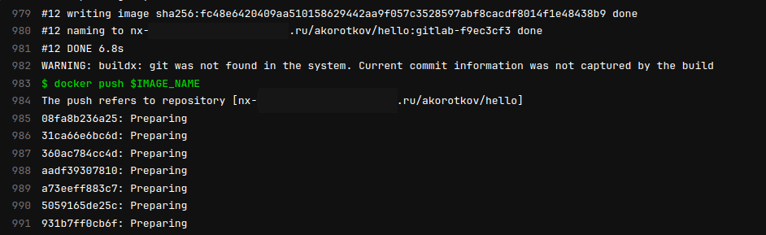
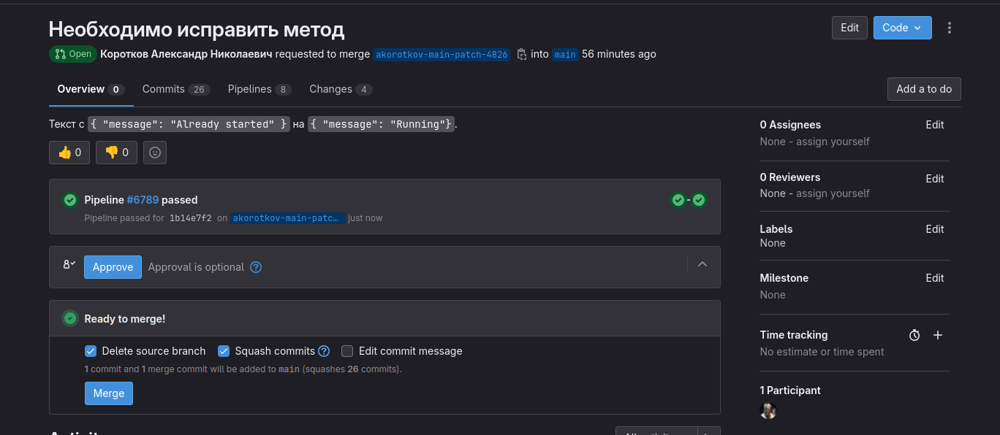

# Домашнее задание к занятию 12 «GitLab»

## Подготовка к выполнению

Gitlab не дает регистрацию, поэтому реализовано в корпоративном Gitlab-CE

## Основная часть

### DevOps

В репозитории содержится код проекта на Python. Проект — RESTful API сервис. Ваша задача — автоматизировать сборку образа с выполнением python-скрипта:

1. Образ собирается на основе [centos:7](https://hub.docker.com/_/centos?tab=tags&page=1&ordering=last_updated).
2. Python версии не ниже 3.7.
3. Установлены зависимости: `flask` `flask-jsonpify` `flask-restful`.
4. Создана директория `/python_api`.
5. Скрипт из репозитория размещён в /python_api.
6. Точка вызова: запуск скрипта.
7. При комите в любую ветку должен собираться docker image с форматом имени hello:gitlab-$CI_COMMIT_SHORT_SHA . Образ должен быть выложен в Gitlab registry или yandex registry.   
Образ выложен в Nexus


### Product Owner

Вашему проекту нужна бизнесовая доработка: нужно поменять JSON ответа на вызов метода GET `/rest/api/get_info`, необходимо создать Issue в котором указать:

1. Какой метод необходимо исправить.
2. Текст с `{ "message": "Already started" }` на `{ "message": "Running"}`.
3. Issue поставить label: feature.

### Developer

Пришёл новый Issue на доработку, вам нужно:

1. Создать отдельную ветку, связанную с этим Issue.
2. Внести изменения по тексту из задания.
3. Подготовить Merge Request, влить необходимые изменения в `master`, проверить, что сборка прошла успешно.


### Tester

Разработчики выполнили новый Issue, необходимо проверить валидность изменений:

1. Поднять докер-контейнер с образом `python-api:latest` и проверить возврат метода на корректность.
2. Закрыть Issue с комментарием об успешности прохождения, указав желаемый результат и фактически достигнутый.

## Итог

Лог:
```
Running with gitlab-runner 16.11.1 (535ced5f)
  on stand-docker tdmHx2QQ, system ID: s_565e7b6b4182
section_start:1721070020:prepare_executor
Preparing the "docker" executor
Using Docker executor with image nx-/docker:24.0.5 ...
Starting service nx-/docker:24.0.5-dind ...
Pulling docker image nx-/docker:24.0.5-dind ...
Using docker image sha256:7015f2c475d511a251955877c2862016a4042512ba625ed905e69202f87e1a21 for nx-/docker:24.0.5-dind with digest docker@sha256:3c6e4dca7a63c9a32a4e00da40461ce067f255987ccc9721cf18ffa087bcd1ef ...
Waiting for services to be up and running (timeout 30 seconds)...
Pulling docker image nx-/docker:24.0.5 ...
Using docker image sha256:7015f2c475d511a251955877c2862016a4042512ba625ed905e69202f87e1a21 for nx-/docker:24.0.5 with digest docker@sha256:3c6e4dca7a63c9a32a4e00da40461ce067f255987ccc9721cf18ffa087bcd1ef ...
section_end:1721070040:prepare_executor
section_start:1721070040:prepare_script
Preparing environment
Running on runner-tdmhx2qq-project-193-concurrent-0 via so-local...
section_end:1721070041:prepare_script
section_start:1721070041:get_sources
Getting source from Git repository
Fetching changes with git depth set to 20...
Reinitialized existing Git repository in /builds/cicd/.git/
Checking out 31ab69fb as detached HEAD (ref is 1.0.0)...

Skipping Git submodules setup
section_end:1721070042:get_sources
section_start:1721070042:step_script
Executing "step_script" stage of the job script
Using docker image sha256:7015f2c475d511a251955877c2862016a4042512ba625ed905e69202f87e1a21 for nx-/docker:24.0.5 with digest docker@sha256:3c6e4dca7a63c9a32a4e00da40461ce067f255987ccc9721cf18ffa087bcd1ef ...
$ docker login -u $CI_REGISTRY_USER -p $CI_REGISTRY_PASSWORD $CI_DOCKER_REGISTRY
WARNING! Using --password via the CLI is insecure. Use --password-stdin.
WARNING! Your password will be stored unencrypted in /root/.docker/config.json.
Configure a credential helper to remove this warning. See
https://docs.docker.com/engine/reference/commandline/login/#credentials-store

Login Succeeded
$ docker images ls
REPOSITORY   TAG       IMAGE ID   CREATED   SIZE
$ docker pull nx-/centos:7
7: Pulling from centos
2d473b07cdd5: Pulling fs layer
2d473b07cdd5: Download complete
2d473b07cdd5: Pull complete
Digest: sha256:dead07b4d8ed7e29e98de0f4504d87e8880d4347859d839686a31da35a3b532f
Status: Downloaded newer image for nx-/centos:7
nx-/centos:7
$ docker build -t $IMAGE_NAME .
#0 building with "default" instance using docker driver

#1 [internal] load .dockerignore
#1 transferring context: 2B done
#1 DONE 0.0s

#2 [internal] load build definition from Dockerfile
#2 transferring dockerfile: 345B done
#2 DONE 0.0s

#3 [internal] load metadata for nx-/ubuntu:22.04
#3 DONE 0.1s

#4 [internal] load build context
#4 transferring context: 516B done
#4 DONE 0.0s

#5 [1/7] FROM nx-/ubuntu:22.04@sha256:bd1487129c4e01470664c3f3c9a25ce01f73ff3df75ffa7eb3388d3d4b945369
#5 resolve nx-/ubuntu:22.04@sha256:bd1487129c4e01470664c3f3c9a25ce01f73ff3df75ffa7eb3388d3d4b945369 done
#5 sha256:bd1487129c4e01470664c3f3c9a25ce01f73ff3df75ffa7eb3388d3d4b945369 529B / 529B done
#5 sha256:8a3cdc4d1ad3e314a91f76b7b99eed443f2152e3a9bf33e46669b31d094be443 2.30kB / 2.30kB done
#5 sha256:9b857f539cb142c9aa2201a17bb8e1cd5cf12edd4a65adf5732fe9f4343964cf 4.19MB / 30.44MB 0.1s
#5 sha256:9b857f539cb142c9aa2201a17bb8e1cd5cf12edd4a65adf5732fe9f4343964cf 10.49MB / 30.44MB 0.2s
#5 sha256:9b857f539cb142c9aa2201a17bb8e1cd5cf12edd4a65adf5732fe9f4343964cf 30.44MB / 30.44MB 0.4s
#5 sha256:9b857f539cb142c9aa2201a17bb8e1cd5cf12edd4a65adf5732fe9f4343964cf 30.44MB / 30.44MB 0.4s done
#5 extracting sha256:9b857f539cb142c9aa2201a17bb8e1cd5cf12edd4a65adf5732fe9f4343964cf
#5 extracting sha256:9b857f539cb142c9aa2201a17bb8e1cd5cf12edd4a65adf5732fe9f4343964cf 2.5s done
#5 DONE 3.3s

#6 [2/7] RUN apt update
#6 0.284 
#6 0.284 WARNING: apt does not have a stable CLI interface. Use with caution in scripts.
#6 0.284 
#6 0.595 Get:1 http://security.ubuntu.com/ubuntu jammy-security InRelease [129 kB]
#6 0.705 Get:2 http://archive.ubuntu.com/ubuntu jammy InRelease [270 kB]
#6 1.346 Get:3 http://security.ubuntu.com/ubuntu jammy-security/multiverse amd64 Packages [44.7 kB]
#6 1.399 Get:4 http://archive.ubuntu.com/ubuntu jammy-updates InRelease [128 kB]
#6 1.515 Get:5 http://security.ubuntu.com/ubuntu jammy-security/restricted amd64 Packages [2655 kB]
#6 1.568 Get:6 http://archive.ubuntu.com/ubuntu jammy-backports InRelease [127 kB]
#6 1.737 Get:7 http://archive.ubuntu.com/ubuntu jammy/restricted amd64 Packages [164 kB]
#6 1.795 Get:8 http://archive.ubuntu.com/ubuntu jammy/main amd64 Packages [1792 kB]
#6 2.085 Get:9 http://security.ubuntu.com/ubuntu jammy-security/main amd64 Packages [2034 kB]
#6 2.151 Get:10 http://archive.ubuntu.com/ubuntu jammy/multiverse amd64 Packages [266 kB]
#6 2.169 Get:11 http://archive.ubuntu.com/ubuntu jammy/universe amd64 Packages [17.5 MB]
#6 2.181 Get:12 http://security.ubuntu.com/ubuntu jammy-security/universe amd64 Packages [1127 kB]
#6 2.960 Get:13 http://archive.ubuntu.com/ubuntu jammy-updates/multiverse amd64 Packages [51.8 kB]
#6 2.960 Get:14 http://archive.ubuntu.com/ubuntu jammy-updates/universe amd64 Packages [1411 kB]
#6 3.006 Get:15 http://archive.ubuntu.com/ubuntu jammy-updates/main amd64 Packages [2299 kB]
#6 3.123 Get:16 http://archive.ubuntu.com/ubuntu jammy-updates/restricted amd64 Packages [2728 kB]
#6 3.247 Get:17 http://archive.ubuntu.com/ubuntu jammy-backports/main amd64 Packages [81.0 kB]
#6 3.249 Get:18 http://archive.ubuntu.com/ubuntu jammy-backports/universe amd64 Packages [32.2 kB]
#6 4.240 Fetched 32.8 MB in 4s (8390 kB/s)
#6 4.240 Reading package lists...
#6 5.412 Building dependency tree...
#6 5.589 Reading state information...
#6 5.604 All packages are up to date.
#6 DONE 5.9s

#7 [3/7] RUN apt install -y python3 python3-pip
#7 0.452 
#7 0.452 WARNING: apt does not have a stable CLI interface. Use with caution in scripts.
#7 0.452 
#7 0.513 Reading package lists...
#7 1.648 Building dependency tree...
#7 1.834 Reading state information...
#7 2.062 The following additional packages will be installed:
#7 2.062   binutils binutils-common binutils-x86-64-linux-gnu build-essential bzip2
#7 2.062   ca-certificates cpp cpp-11 dirmngr dpkg-dev fakeroot fontconfig-config
#7 2.062   fonts-dejavu-core g++ g++-11 gcc gcc-11 gcc-11-base gnupg gnupg-l10n
#7 2.062   gnupg-utils gpg gpg-agent gpg-wks-client gpg-wks-server gpgconf gpgsm
#7 2.062   javascript-common libalgorithm-diff-perl libalgorithm-diff-xs-perl
#7 2.062   libalgorithm-merge-perl libasan6 libassuan0 libatomic1 libbinutils
#7 2.062   libbrotli1 libbsd0 libc-dev-bin libc-devtools libc6-dev libcc1-0
#7 2.062   libcrypt-dev libctf-nobfd0 libctf0 libdeflate0 libdpkg-perl libexpat1
#7 2.062   libexpat1-dev libfakeroot libfile-fcntllock-perl libfontconfig1 libfreetype6
#7 2.063   libgcc-11-dev libgd3 libgdbm-compat4 libgdbm6 libgomp1 libisl23 libitm1
#7 2.063   libjbig0 libjpeg-turbo8 libjpeg8 libjs-jquery libjs-sphinxdoc
#7 2.063   libjs-underscore libksba8 libldap-2.5-0 libldap-common
#7 2.063   liblocale-gettext-perl liblsan0 libmd0 libmpc3 libmpdec3 libmpfr6 libnpth0
#7 2.063   libnsl-dev libperl5.34 libpng16-16 libpython3-dev libpython3-stdlib
#7 2.063   libpython3.10 libpython3.10-dev libpython3.10-minimal libpython3.10-stdlib
#7 2.063   libquadmath0 libreadline8 libsasl2-2 libsasl2-modules libsasl2-modules-db
#7 2.063   libsqlite3-0 libstdc++-11-dev libtiff5 libtirpc-dev libtsan0 libubsan1
#7 2.063   libwebp7 libx11-6 libx11-data libxau6 libxcb1 libxdmcp6 libxpm4
#7 2.063   linux-libc-dev lto-disabled-list make manpages manpages-dev media-types
#7 2.063   netbase openssl patch perl perl-modules-5.34 pinentry-curses python3-dev
#7 2.063   python3-distutils python3-lib2to3 python3-minimal python3-pkg-resources
#7 2.063   python3-setuptools python3-wheel python3.10 python3.10-dev
#7 2.064   python3.10-minimal readline-common rpcsvc-proto ucf xz-utils zlib1g-dev
#7 2.065 Suggested packages:
#7 2.065   binutils-doc bzip2-doc cpp-doc gcc-11-locales dbus-user-session
#7 2.065   libpam-systemd pinentry-gnome3 tor debian-keyring g++-multilib
#7 2.065   g++-11-multilib gcc-11-doc gcc-multilib autoconf automake libtool flex bison
#7 2.065   gdb gcc-doc gcc-11-multilib parcimonie xloadimage scdaemon apache2
#7 2.065   | lighttpd | httpd glibc-doc git bzr libgd-tools gdbm-l10n
#7 2.065   libsasl2-modules-gssapi-mit | libsasl2-modules-gssapi-heimdal
#7 2.065   libsasl2-modules-ldap libsasl2-modules-otp libsasl2-modules-sql
#7 2.065   libstdc++-11-doc make-doc man-browser ed diffutils-doc perl-doc
#7 2.065   libterm-readline-gnu-perl | libterm-readline-perl-perl
#7 2.065   libtap-harness-archive-perl pinentry-doc python3-doc python3-tk python3-venv
#7 2.065   python-setuptools-doc python3.10-venv python3.10-doc binfmt-support
#7 2.065   readline-doc
#7 2.357 The following NEW packages will be installed:
#7 2.357   binutils binutils-common binutils-x86-64-linux-gnu build-essential bzip2
#7 2.357   ca-certificates cpp cpp-11 dirmngr dpkg-dev fakeroot fontconfig-config
#7 2.357   fonts-dejavu-core g++ g++-11 gcc gcc-11 gcc-11-base gnupg gnupg-l10n
#7 2.357   gnupg-utils gpg gpg-agent gpg-wks-client gpg-wks-server gpgconf gpgsm
#7 2.357   javascript-common libalgorithm-diff-perl libalgorithm-diff-xs-perl
#7 2.357   libalgorithm-merge-perl libasan6 libassuan0 libatomic1 libbinutils
#7 2.357   libbrotli1 libbsd0 libc-dev-bin libc-devtools libc6-dev libcc1-0
#7 2.357   libcrypt-dev libctf-nobfd0 libctf0 libdeflate0 libdpkg-perl libexpat1
#7 2.357   libexpat1-dev libfakeroot libfile-fcntllock-perl libfontconfig1 libfreetype6
#7 2.358   libgcc-11-dev libgd3 libgdbm-compat4 libgdbm6 libgomp1 libisl23 libitm1
#7 2.358   libjbig0 libjpeg-turbo8 libjpeg8 libjs-jquery libjs-sphinxdoc
#7 2.358   libjs-underscore libksba8 libldap-2.5-0 libldap-common
#7 2.358   liblocale-gettext-perl liblsan0 libmd0 libmpc3 libmpdec3 libmpfr6 libnpth0
#7 2.358   libnsl-dev libperl5.34 libpng16-16 libpython3-dev libpython3-stdlib
#7 2.358   libpython3.10 libpython3.10-dev libpython3.10-minimal libpython3.10-stdlib
#7 2.358   libquadmath0 libreadline8 libsasl2-2 libsasl2-modules libsasl2-modules-db
#7 2.358   libsqlite3-0 libstdc++-11-dev libtiff5 libtirpc-dev libtsan0 libubsan1
#7 2.358   libwebp7 libx11-6 libx11-data libxau6 libxcb1 libxdmcp6 libxpm4
#7 2.359   linux-libc-dev lto-disabled-list make manpages manpages-dev media-types
#7 2.359   netbase openssl patch perl perl-modules-5.34 pinentry-curses python3
#7 2.359   python3-dev python3-distutils python3-lib2to3 python3-minimal python3-pip
#7 2.359   python3-pkg-resources python3-setuptools python3-wheel python3.10
#7 2.359   python3.10-dev python3.10-minimal readline-common rpcsvc-proto ucf xz-utils
#7 2.359   zlib1g-dev
#7 2.639 0 upgraded, 131 newly installed, 0 to remove and 0 not upgraded.
#7 2.639 Need to get 101 MB of archives.
#7 2.639 After this operation, 356 MB of additional disk space will be used.
#7 2.639 Get:1 http://archive.ubuntu.com/ubuntu jammy/main amd64 liblocale-gettext-perl amd64 1.07-4build3 [17.1 kB]
#7 2.890 Get:2 http://archive.ubuntu.com/ubuntu jammy-updates/main amd64 libpython3.10-minimal amd64 3.10.12-1~22.04.4 [812 kB]
#7 3.529 Get:3 http://archive.ubuntu.com/ubuntu jammy-updates/main amd64 libexpat1 amd64 2.4.7-1ubuntu0.3 [91.0 kB]
#7 3.547 Get:4 http://archive.ubuntu.com/ubuntu jammy-updates/main amd64 python3.10-minimal amd64 3.10.12-1~22.04.4 [2245 kB]
#7 3.768 Get:5 http://archive.ubuntu.com/ubuntu jammy-updates/main amd64 python3-minimal amd64 3.10.6-1~22.04 [24.3 kB]
#7 3.769 Get:6 http://archive.ubuntu.com/ubuntu jammy/main amd64 media-types all 7.0.0 [25.5 kB]
#7 3.770 Get:7 http://archive.ubuntu.com/ubuntu jammy/main amd64 libmpdec3 amd64 2.5.1-2build2 [86.8 kB]
#7 3.775 Get:8 http://archive.ubuntu.com/ubuntu jammy/main amd64 readline-common all 8.1.2-1 [53.5 kB]
#7 3.778 Get:9 http://archive.ubuntu.com/ubuntu jammy/main amd64 libreadline8 amd64 8.1.2-1 [153 kB]
#7 3.786 Get:10 http://archive.ubuntu.com/ubuntu jammy-updates/main amd64 libsqlite3-0 amd64 3.37.2-2ubuntu0.3 [641 kB]
#7 3.818 Get:11 http://archive.ubuntu.com/ubuntu jammy-updates/main amd64 libpython3.10-stdlib amd64 3.10.12-1~22.04.4 [1849 kB]
#7 3.883 Get:12 http://archive.ubuntu.com/ubuntu jammy-updates/main amd64 python3.10 amd64 3.10.12-1~22.04.4 [508 kB]
#7 3.902 Get:13 http://archive.ubuntu.com/ubuntu jammy-updates/main amd64 libpython3-stdlib amd64 3.10.6-1~22.04 [6910 B]
#7 3.902 Get:14 http://archive.ubuntu.com/ubuntu jammy-updates/main amd64 python3 amd64 3.10.6-1~22.04 [22.8 kB]
#7 3.904 Get:15 http://archive.ubuntu.com/ubuntu jammy-updates/main amd64 perl-modules-5.34 all 5.34.0-3ubuntu1.3 [2976 kB]
#7 4.023 Get:16 http://archive.ubuntu.com/ubuntu jammy/main amd64 libgdbm6 amd64 1.23-1 [33.9 kB]
#7 4.024 Get:17 http://archive.ubuntu.com/ubuntu jammy/main amd64 libgdbm-compat4 amd64 1.23-1 [6606 B]
#7 4.024 Get:18 http://archive.ubuntu.com/ubuntu jammy-updates/main amd64 libperl5.34 amd64 5.34.0-3ubuntu1.3 [4820 kB]
#7 4.241 Get:19 http://archive.ubuntu.com/ubuntu jammy-updates/main amd64 perl amd64 5.34.0-3ubuntu1.3 [232 kB]
#7 4.245 Get:20 http://archive.ubuntu.com/ubuntu jammy-updates/main amd64 openssl amd64 3.0.2-0ubuntu1.16 [1186 kB]
#7 4.279 Get:21 http://archive.ubuntu.com/ubuntu jammy-updates/main amd64 ca-certificates all 20230311ubuntu0.22.04.1 [155 kB]
#7 4.281 Get:22 http://archive.ubuntu.com/ubuntu jammy/main amd64 libmd0 amd64 1.0.4-1build1 [23.0 kB]
#7 4.282 Get:23 http://archive.ubuntu.com/ubuntu jammy/main amd64 libbsd0 amd64 0.11.5-1 [44.8 kB]
#7 4.283 Get:24 http://archive.ubuntu.com/ubuntu jammy/main amd64 netbase all 6.3 [12.9 kB]
#7 4.284 Get:25 http://archive.ubuntu.com/ubuntu jammy-updates/main amd64 python3-pkg-resources all 59.6.0-1.2ubuntu0.22.04.1 [132 kB]
#7 4.286 Get:26 http://archive.ubuntu.com/ubuntu jammy/main amd64 ucf all 3.0043 [56.1 kB]
#7 4.288 Get:27 http://archive.ubuntu.com/ubuntu jammy/main amd64 libpng16-16 amd64 1.6.37-3build5 [191 kB]
#7 4.395 Get:28 http://archive.ubuntu.com/ubuntu jammy/main amd64 libxau6 amd64 1:1.0.9-1build5 [7634 B]
#7 4.396 Get:29 http://archive.ubuntu.com/ubuntu jammy/main amd64 libxdmcp6 amd64 1:1.1.3-0ubuntu5 [10.9 kB]
#7 4.519 Get:30 http://archive.ubuntu.com/ubuntu jammy/main amd64 libxcb1 amd64 1.14-3ubuntu3 [49.0 kB]
#7 4.521 Get:31 http://archive.ubuntu.com/ubuntu jammy-updates/main amd64 libx11-data all 2:1.7.5-1ubuntu0.3 [120 kB]
#7 4.524 Get:32 http://archive.ubuntu.com/ubuntu jammy-updates/main amd64 libx11-6 amd64 2:1.7.5-1ubuntu0.3 [667 kB]
#7 4.539 Get:33 http://archive.ubuntu.com/ubuntu jammy/main amd64 manpages all 5.10-1ubuntu1 [1375 kB]
#7 4.555 Get:34 http://archive.ubuntu.com/ubuntu jammy/main amd64 xz-utils amd64 5.2.5-2ubuntu1 [84.8 kB]
#7 4.556 Get:35 http://archive.ubuntu.com/ubuntu jammy-updates/main amd64 binutils-common amd64 2.38-4ubuntu2.6 [222 kB]
#7 4.559 Get:36 http://archive.ubuntu.com/ubuntu jammy-updates/main amd64 libbinutils amd64 2.38-4ubuntu2.6 [662 kB]
#7 4.644 Get:37 http://archive.ubuntu.com/ubuntu jammy-updates/main amd64 libctf-nobfd0 amd64 2.38-4ubuntu2.6 [108 kB]
#7 4.648 Get:38 http://archive.ubuntu.com/ubuntu jammy-updates/main amd64 libctf0 amd64 2.38-4ubuntu2.6 [103 kB]
#7 4.651 Get:39 http://archive.ubuntu.com/ubuntu jammy-updates/main amd64 binutils-x86-64-linux-gnu amd64 2.38-4ubuntu2.6 [2326 kB]
#7 4.765 Get:40 http://archive.ubuntu.com/ubuntu jammy-updates/main amd64 binutils amd64 2.38-4ubuntu2.6 [3200 B]
#7 4.766 Get:41 http://archive.ubuntu.com/ubuntu jammy-updates/main amd64 libc-dev-bin amd64 2.35-0ubuntu3.8 [20.3 kB]
#7 4.767 Get:42 http://archive.ubuntu.com/ubuntu jammy-updates/main amd64 linux-libc-dev amd64 5.15.0-116.126 [1338 kB]
#7 4.794 Get:43 http://archive.ubuntu.com/ubuntu jammy/main amd64 libcrypt-dev amd64 1:4.4.27-1 [112 kB]
#7 4.796 Get:44 http://archive.ubuntu.com/ubuntu jammy/main amd64 rpcsvc-proto amd64 1.4.2-0ubuntu6 [68.5 kB]
#7 4.797 Get:45 http://archive.ubuntu.com/ubuntu jammy-updates/main amd64 libtirpc-dev amd64 1.3.2-2ubuntu0.1 [192 kB]
#7 4.888 Get:46 http://archive.ubuntu.com/ubuntu jammy/main amd64 libnsl-dev amd64 1.3.0-2build2 [71.3 kB]
#7 4.891 Get:47 http://archive.ubuntu.com/ubuntu jammy-updates/main amd64 libc6-dev amd64 2.35-0ubuntu3.8 [2100 kB]
#7 4.925 Get:48 http://archive.ubuntu.com/ubuntu jammy-updates/main amd64 gcc-11-base amd64 11.4.0-1ubuntu1~22.04 [20.2 kB]
#7 4.925 Get:49 http://archive.ubuntu.com/ubuntu jammy/main amd64 libisl23 amd64 0.24-2build1 [727 kB]
#7 5.012 Get:50 http://archive.ubuntu.com/ubuntu jammy/main amd64 libmpfr6 amd64 4.1.0-3build3 [1425 kB]
#7 5.040 Get:51 http://archive.ubuntu.com/ubuntu jammy/main amd64 libmpc3 amd64 1.2.1-2build1 [46.9 kB]
#7 5.040 Get:52 http://archive.ubuntu.com/ubuntu jammy-updates/main amd64 cpp-11 amd64 11.4.0-1ubuntu1~22.04 [10.0 MB]
#7 5.517 Get:53 http://archive.ubuntu.com/ubuntu jammy/main amd64 cpp amd64 4:11.2.0-1ubuntu1 [27.7 kB]
#7 5.518 Get:54 http://archive.ubuntu.com/ubuntu jammy-updates/main amd64 libcc1-0 amd64 12.3.0-1ubuntu1~22.04 [48.3 kB]
#7 5.521 Get:55 http://archive.ubuntu.com/ubuntu jammy-updates/main amd64 libgomp1 amd64 12.3.0-1ubuntu1~22.04 [126 kB]
#7 5.524 Get:56 http://archive.ubuntu.com/ubuntu jammy-updates/main amd64 libitm1 amd64 12.3.0-1ubuntu1~22.04 [30.2 kB]
#7 5.525 Get:57 http://archive.ubuntu.com/ubuntu jammy-updates/main amd64 libatomic1 amd64 12.3.0-1ubuntu1~22.04 [10.4 kB]
#7 5.526 Get:58 http://archive.ubuntu.com/ubuntu jammy-updates/main amd64 libasan6 amd64 11.4.0-1ubuntu1~22.04 [2282 kB]
#7 5.554 Get:59 http://archive.ubuntu.com/ubuntu jammy-updates/main amd64 liblsan0 amd64 12.3.0-1ubuntu1~22.04 [1069 kB]
#7 5.654 Get:60 http://archive.ubuntu.com/ubuntu jammy-updates/main amd64 libtsan0 amd64 11.4.0-1ubuntu1~22.04 [2260 kB]
#7 5.770 Get:61 http://archive.ubuntu.com/ubuntu jammy-updates/main amd64 libubsan1 amd64 12.3.0-1ubuntu1~22.04 [976 kB]
#7 5.787 Get:62 http://archive.ubuntu.com/ubuntu jammy-updates/main amd64 libquadmath0 amd64 12.3.0-1ubuntu1~22.04 [154 kB]
#7 5.789 Get:63 http://archive.ubuntu.com/ubuntu jammy-updates/main amd64 libgcc-11-dev amd64 11.4.0-1ubuntu1~22.04 [2517 kB]
#7 5.905 Get:64 http://archive.ubuntu.com/ubuntu jammy-updates/main amd64 gcc-11 amd64 11.4.0-1ubuntu1~22.04 [20.1 MB]
#7 6.791 Get:65 http://archive.ubuntu.com/ubuntu jammy/main amd64 gcc amd64 4:11.2.0-1ubuntu1 [5112 B]
#7 6.791 Get:66 http://archive.ubuntu.com/ubuntu jammy-updates/main amd64 libstdc++-11-dev amd64 11.4.0-1ubuntu1~22.04 [2101 kB]
#7 6.817 Get:67 http://archive.ubuntu.com/ubuntu jammy-updates/main amd64 g++-11 amd64 11.4.0-1ubuntu1~22.04 [11.4 MB]
#7 7.489 Get:68 http://archive.ubuntu.com/ubuntu jammy/main amd64 g++ amd64 4:11.2.0-1ubuntu1 [1412 B]
#7 7.489 Get:69 http://archive.ubuntu.com/ubuntu jammy/main amd64 make amd64 4.3-4.1build1 [180 kB]
#7 7.493 Get:70 http://archive.ubuntu.com/ubuntu jammy-updates/main amd64 libdpkg-perl all 1.21.1ubuntu2.3 [237 kB]
#7 7.518 Get:71 http://archive.ubuntu.com/ubuntu jammy/main amd64 bzip2 amd64 1.0.8-5build1 [34.8 kB]
#7 7.519 Get:72 http://archive.ubuntu.com/ubuntu jammy/main amd64 patch amd64 2.7.6-7build2 [109 kB]
#7 7.537 Get:73 http://archive.ubuntu.com/ubuntu jammy/main amd64 lto-disabled-list all 24 [12.5 kB]
#7 7.538 Get:74 http://archive.ubuntu.com/ubuntu jammy-updates/main amd64 dpkg-dev all 1.21.1ubuntu2.3 [922 kB]
#7 7.568 Get:75 http://archive.ubuntu.com/ubuntu jammy/main amd64 build-essential amd64 12.9ubuntu3 [4744 B]
#7 7.568 Get:76 http://archive.ubuntu.com/ubuntu jammy/main amd64 libassuan0 amd64 2.5.5-1build1 [38.2 kB]
#7 7.616 Get:77 http://archive.ubuntu.com/ubuntu jammy-updates/main amd64 gpgconf amd64 2.2.27-3ubuntu2.1 [94.2 kB]
#7 7.619 Get:78 http://archive.ubuntu.com/ubuntu jammy-updates/main amd64 libksba8 amd64 1.6.0-2ubuntu0.2 [119 kB]
#7 7.739 Get:79 http://archive.ubuntu.com/ubuntu jammy-updates/main amd64 libsasl2-modules-db amd64 2.1.27+dfsg2-3ubuntu1.2 [20.5 kB]
#7 7.740 Get:80 http://archive.ubuntu.com/ubuntu jammy-updates/main amd64 libsasl2-2 amd64 2.1.27+dfsg2-3ubuntu1.2 [53.8 kB]
#7 7.742 Get:81 http://archive.ubuntu.com/ubuntu jammy-updates/main amd64 libldap-2.5-0 amd64 2.5.18+dfsg-0ubuntu0.22.04.1 [183 kB]
#7 7.747 Get:82 http://archive.ubuntu.com/ubuntu jammy/main amd64 libnpth0 amd64 1.6-3build2 [8664 B]
#7 7.747 Get:83 http://archive.ubuntu.com/ubuntu jammy-updates/main amd64 dirmngr amd64 2.2.27-3ubuntu2.1 [293 kB]
#7 7.756 Get:84 http://archive.ubuntu.com/ubuntu jammy/main amd64 libfakeroot amd64 1.28-1ubuntu1 [31.5 kB]
#7 7.757 Get:85 http://archive.ubuntu.com/ubuntu jammy/main amd64 fakeroot amd64 1.28-1ubuntu1 [60.4 kB]
#7 7.759 Get:86 http://archive.ubuntu.com/ubuntu jammy/main amd64 fonts-dejavu-core all 2.37-2build1 [1041 kB]
#7 7.862 Get:87 http://archive.ubuntu.com/ubuntu jammy/main amd64 fontconfig-config all 2.13.1-4.2ubuntu5 [29.1 kB]
#7 7.864 Get:88 http://archive.ubuntu.com/ubuntu jammy-updates/main amd64 gnupg-l10n all 2.2.27-3ubuntu2.1 [54.4 kB]
#7 7.986 Get:89 http://archive.ubuntu.com/ubuntu jammy-updates/main amd64 gnupg-utils amd64 2.2.27-3ubuntu2.1 [308 kB]
#7 7.996 Get:90 http://archive.ubuntu.com/ubuntu jammy-updates/main amd64 gpg amd64 2.2.27-3ubuntu2.1 [519 kB]
#7 8.012 Get:91 http://archive.ubuntu.com/ubuntu jammy/main amd64 pinentry-curses amd64 1.1.1-1build2 [34.4 kB]
#7 8.013 Get:92 http://archive.ubuntu.com/ubuntu jammy-updates/main amd64 gpg-agent amd64 2.2.27-3ubuntu2.1 [209 kB]
#7 8.020 Get:93 http://archive.ubuntu.com/ubuntu jammy-updates/main amd64 gpg-wks-client amd64 2.2.27-3ubuntu2.1 [62.7 kB]
#7 8.022 Get:94 http://archive.ubuntu.com/ubuntu jammy-updates/main amd64 gpg-wks-server amd64 2.2.27-3ubuntu2.1 [57.5 kB]
#7 8.024 Get:95 http://archive.ubuntu.com/ubuntu jammy-updates/main amd64 gpgsm amd64 2.2.27-3ubuntu2.1 [197 kB]
#7 8.030 Get:96 http://archive.ubuntu.com/ubuntu jammy-updates/main amd64 gnupg all 2.2.27-3ubuntu2.1 [315 kB]
#7 8.109 Get:97 http://archive.ubuntu.com/ubuntu jammy/main amd64 javascript-common all 11+nmu1 [5936 B]
#7 8.110 Get:98 http://archive.ubuntu.com/ubuntu jammy/main amd64 libalgorithm-diff-perl all 1.201-1 [41.8 kB]
#7 8.232 Get:99 http://archive.ubuntu.com/ubuntu jammy/main amd64 libalgorithm-diff-xs-perl amd64 0.04-6build3 [11.9 kB]
#7 8.233 Get:100 http://archive.ubuntu.com/ubuntu jammy/main amd64 libalgorithm-merge-perl all 0.08-3 [12.0 kB]
#7 8.234 Get:101 http://archive.ubuntu.com/ubuntu jammy/main amd64 libbrotli1 amd64 1.0.9-2build6 [315 kB]
#7 8.340 Get:102 http://archive.ubuntu.com/ubuntu jammy-updates/main amd64 libfreetype6 amd64 2.11.1+dfsg-1ubuntu0.2 [389 kB]
#7 8.628 Get:103 http://archive.ubuntu.com/ubuntu jammy/main amd64 libfontconfig1 amd64 2.13.1-4.2ubuntu5 [131 kB]
#7 8.639 Get:104 http://archive.ubuntu.com/ubuntu jammy/main amd64 libjpeg-turbo8 amd64 2.1.2-0ubuntu1 [134 kB]
#7 8.650 Get:105 http://archive.ubuntu.com/ubuntu jammy/main amd64 libjpeg8 amd64 8c-2ubuntu10 [2264 B]
#7 8.650 Get:106 http://archive.ubuntu.com/ubuntu jammy/main amd64 libdeflate0 amd64 1.10-2 [70.9 kB]
#7 8.655 Get:107 http://archive.ubuntu.com/ubuntu jammy-updates/main amd64 libjbig0 amd64 2.1-3.1ubuntu0.22.04.1 [29.2 kB]
#7 8.658 Get:108 http://archive.ubuntu.com/ubuntu jammy-updates/main amd64 libwebp7 amd64 1.2.2-2ubuntu0.22.04.2 [206 kB]
#7 8.689 Get:109 http://archive.ubuntu.com/ubuntu jammy-updates/main amd64 libtiff5 amd64 4.3.0-6ubuntu0.9 [185 kB]
#7 8.704 Get:110 http://archive.ubuntu.com/ubuntu jammy-updates/main amd64 libxpm4 amd64 1:3.5.12-1ubuntu0.22.04.2 [36.7 kB]
#7 8.707 Get:111 http://archive.ubuntu.com/ubuntu jammy/main amd64 libgd3 amd64 2.3.0-2ubuntu2 [129 kB]
#7 8.716 Get:112 http://archive.ubuntu.com/ubuntu jammy-updates/main amd64 libc-devtools amd64 2.35-0ubuntu3.8 [28.9 kB]
#7 8.723 Get:113 http://archive.ubuntu.com/ubuntu jammy-updates/main amd64 libexpat1-dev amd64 2.4.7-1ubuntu0.3 [147 kB]
#7 8.729 Get:114 http://archive.ubuntu.com/ubuntu jammy/main amd64 libfile-fcntllock-perl amd64 0.22-3build7 [33.9 kB]
#7 8.730 Get:115 http://archive.ubuntu.com/ubuntu jammy/main amd64 libjs-jquery all 3.6.0+dfsg+~3.5.13-1 [321 kB]
#7 8.743 Get:116 http://archive.ubuntu.com/ubuntu jammy/main amd64 libjs-underscore all 1.13.2~dfsg-2 [118 kB]
#7 8.748 Get:117 http://archive.ubuntu.com/ubuntu jammy/main amd64 libjs-sphinxdoc all 4.3.2-1 [139 kB]
#7 8.770 Get:118 http://archive.ubuntu.com/ubuntu jammy-updates/main amd64 libldap-common all 2.5.18+dfsg-0ubuntu0.22.04.1 [15.9 kB]
#7 8.771 Get:119 http://archive.ubuntu.com/ubuntu jammy-updates/main amd64 libpython3.10 amd64 3.10.12-1~22.04.4 [1949 kB]
#7 8.811 Get:120 http://archive.ubuntu.com/ubuntu jammy-updates/main amd64 zlib1g-dev amd64 1:1.2.11.dfsg-2ubuntu9.2 [164 kB]
#7 8.819 Get:121 http://archive.ubuntu.com/ubuntu jammy-updates/main amd64 libpython3.10-dev amd64 3.10.12-1~22.04.4 [4763 kB]
#7 8.895 Get:122 http://archive.ubuntu.com/ubuntu jammy-updates/main amd64 libpython3-dev amd64 3.10.6-1~22.04 [7166 B]
#7 8.895 Get:123 http://archive.ubuntu.com/ubuntu jammy-updates/main amd64 libsasl2-modules amd64 2.1.27+dfsg2-3ubuntu1.2 [68.8 kB]
#7 8.896 Get:124 http://archive.ubuntu.com/ubuntu jammy/main amd64 manpages-dev all 5.10-1ubuntu1 [2309 kB]
#7 8.937 Get:125 http://archive.ubuntu.com/ubuntu jammy-updates/main amd64 python3.10-dev amd64 3.10.12-1~22.04.4 [508 kB]
#7 8.943 Get:126 http://archive.ubuntu.com/ubuntu jammy-updates/main amd64 python3-lib2to3 all 3.10.8-1~22.04 [77.6 kB]
#7 8.944 Get:127 http://archive.ubuntu.com/ubuntu jammy-updates/main amd64 python3-distutils all 3.10.8-1~22.04 [139 kB]
#7 8.946 Get:128 http://archive.ubuntu.com/ubuntu jammy-updates/main amd64 python3-dev amd64 3.10.6-1~22.04 [26.0 kB]
#7 8.947 Get:129 http://archive.ubuntu.com/ubuntu jammy-updates/main amd64 python3-setuptools all 59.6.0-1.2ubuntu0.22.04.1 [339 kB]
#7 8.955 Get:130 http://archive.ubuntu.com/ubuntu jammy-updates/universe amd64 python3-wheel all 0.37.1-2ubuntu0.22.04.1 [32.0 kB]
#7 8.959 Get:131 http://archive.ubuntu.com/ubuntu jammy-updates/universe amd64 python3-pip all 22.0.2+dfsg-1ubuntu0.4 [1305 kB]
#7 9.202 debconf: delaying package configuration, since apt-utils is not installed
#7 9.251 Fetched 101 MB in 7s (15.3 MB/s)
#7 9.280 Selecting previously unselected package liblocale-gettext-perl.
#7 9.280 (Reading database ... 
(Reading database ... 5%
(Reading database ... 10%
(Reading database ... 15%
(Reading database ... 20%
(Reading database ... 25%
(Reading database ... 30%
(Reading database ... 35%
(Reading database ... 40%
(Reading database ... 45%
(Reading database ... 50%
(Reading database ... 55%
(Reading database ... 60%
(Reading database ... 65%
(Reading database ... 70%
(Reading database ... 75%
(Reading database ... 80%
(Reading database ... 85%
(Reading database ... 90%
(Reading database ... 95%
(Reading database ... 100%
(Reading database ... 4393 files and directories currently installed.)
#7 9.287 Preparing to unpack .../liblocale-gettext-perl_1.07-4build3_amd64.deb ...
#7 9.290 Unpacking liblocale-gettext-perl (1.07-4build3) ...
#7 9.327 Selecting previously unselected package libpython3.10-minimal:amd64.
#7 9.327 Preparing to unpack .../libpython3.10-minimal_3.10.12-1~22.04.4_amd64.deb ...
#7 9.329 Unpacking libpython3.10-minimal:amd64 (3.10.12-1~22.04.4) ...
#7 9.404 Selecting previously unselected package libexpat1:amd64.
#7 9.404 Preparing to unpack .../libexpat1_2.4.7-1ubuntu0.3_amd64.deb ...
#7 9.408 Unpacking libexpat1:amd64 (2.4.7-1ubuntu0.3) ...
#7 9.448 Selecting previously unselected package python3.10-minimal.
#7 9.449 Preparing to unpack .../python3.10-minimal_3.10.12-1~22.04.4_amd64.deb ...
#7 9.457 Unpacking python3.10-minimal (3.10.12-1~22.04.4) ...
#7 9.590 Setting up libpython3.10-minimal:amd64 (3.10.12-1~22.04.4) ...
#7 9.603 Setting up libexpat1:amd64 (2.4.7-1ubuntu0.3) ...
#7 9.610 Setting up python3.10-minimal (3.10.12-1~22.04.4) ...
#7 10.55 Selecting previously unselected package python3-minimal.
#7 10.55 (Reading database ... 
(Reading database ... 5%
(Reading database ... 10%
(Reading database ... 15%
(Reading database ... 20%
(Reading database ... 25%
(Reading database ... 30%
(Reading database ... 35%
(Reading database ... 40%
(Reading database ... 45%
(Reading database ... 50%
(Reading database ... 55%
(Reading database ... 60%
(Reading database ... 65%
(Reading database ... 70%
(Reading database ... 75%
(Reading database ... 80%
(Reading database ... 85%
(Reading database ... 90%
(Reading database ... 95%
(Reading database ... 100%
(Reading database ... 4711 files and directories currently installed.)
#7 10.55 Preparing to unpack .../0-python3-minimal_3.10.6-1~22.04_amd64.deb ...
#7 10.55 Unpacking python3-minimal (3.10.6-1~22.04) ...
#7 10.59 Selecting previously unselected package media-types.
#7 10.59 Preparing to unpack .../1-media-types_7.0.0_all.deb ...
#7 10.59 Unpacking media-types (7.0.0) ...
#7 10.63 Selecting previously unselected package libmpdec3:amd64.
#7 10.63 Preparing to unpack .../2-libmpdec3_2.5.1-2build2_amd64.deb ...
#7 10.63 Unpacking libmpdec3:amd64 (2.5.1-2build2) ...
#7 10.66 Selecting previously unselected package readline-common.
#7 10.66 Preparing to unpack .../3-readline-common_8.1.2-1_all.deb ...
#7 10.67 Unpacking readline-common (8.1.2-1) ...
#7 10.70 Selecting previously unselected package libreadline8:amd64.
#7 10.70 Preparing to unpack .../4-libreadline8_8.1.2-1_amd64.deb ...
#7 10.70 Unpacking libreadline8:amd64 (8.1.2-1) ...
#7 10.74 Selecting previously unselected package libsqlite3-0:amd64.
#7 10.74 Preparing to unpack .../5-libsqlite3-0_3.37.2-2ubuntu0.3_amd64.deb ...
#7 10.74 Unpacking libsqlite3-0:amd64 (3.37.2-2ubuntu0.3) ...
#7 10.80 Selecting previously unselected package libpython3.10-stdlib:amd64.
#7 10.80 Preparing to unpack .../6-libpython3.10-stdlib_3.10.12-1~22.04.4_amd64.deb ...
#7 10.80 Unpacking libpython3.10-stdlib:amd64 (3.10.12-1~22.04.4) ...
#7 10.92 Selecting previously unselected package python3.10.
#7 10.92 Preparing to unpack .../7-python3.10_3.10.12-1~22.04.4_amd64.deb ...
#7 10.92 Unpacking python3.10 (3.10.12-1~22.04.4) ...
#7 10.95 Selecting previously unselected package libpython3-stdlib:amd64.
#7 10.95 Preparing to unpack .../8-libpython3-stdlib_3.10.6-1~22.04_amd64.deb ...
#7 10.96 Unpacking libpython3-stdlib:amd64 (3.10.6-1~22.04) ...
#7 10.99 Setting up python3-minimal (3.10.6-1~22.04) ...
#7 11.29 Selecting previously unselected package python3.
#7 11.29 (Reading database ... 
(Reading database ... 5%
(Reading database ... 10%
(Reading database ... 15%
(Reading database ... 20%
(Reading database ... 25%
(Reading database ... 30%
(Reading database ... 35%
(Reading database ... 40%
(Reading database ... 45%
(Reading database ... 50%
(Reading database ... 55%
(Reading database ... 60%
(Reading database ... 65%
(Reading database ... 70%
(Reading database ... 75%
(Reading database ... 80%
(Reading database ... 85%
(Reading database ... 90%
(Reading database ... 95%
(Reading database ... 100%
(Reading database ... 5141 files and directories currently installed.)
#7 11.29 Preparing to unpack .../000-python3_3.10.6-1~22.04_amd64.deb ...
#7 11.30 Unpacking python3 (3.10.6-1~22.04) ...
#7 11.34 Selecting previously unselected package perl-modules-5.34.
#7 11.34 Preparing to unpack .../001-perl-modules-5.34_5.34.0-3ubuntu1.3_all.deb ...
#7 11.34 Unpacking perl-modules-5.34 (5.34.0-3ubuntu1.3) ...
#7 11.60 Selecting previously unselected package libgdbm6:amd64.
#7 11.60 Preparing to unpack .../002-libgdbm6_1.23-1_amd64.deb ...
#7 11.61 Unpacking libgdbm6:amd64 (1.23-1) ...
#7 11.64 Selecting previously unselected package libgdbm-compat4:amd64.
#7 11.64 Preparing to unpack .../003-libgdbm-compat4_1.23-1_amd64.deb ...
#7 11.64 Unpacking libgdbm-compat4:amd64 (1.23-1) ...
#7 11.68 Selecting previously unselected package libperl5.34:amd64.
#7 11.68 Preparing to unpack .../004-libperl5.34_5.34.0-3ubuntu1.3_amd64.deb ...
#7 11.68 Unpacking libperl5.34:amd64 (5.34.0-3ubuntu1.3) ...
#7 11.94 Selecting previously unselected package perl.
#7 11.94 Preparing to unpack .../005-perl_5.34.0-3ubuntu1.3_amd64.deb ...
#7 11.95 Unpacking perl (5.34.0-3ubuntu1.3) ...
#7 12.00 Selecting previously unselected package openssl.
#7 12.00 Preparing to unpack .../006-openssl_3.0.2-0ubuntu1.16_amd64.deb ...
#7 12.00 Unpacking openssl (3.0.2-0ubuntu1.16) ...
#7 12.07 Selecting previously unselected package ca-certificates.
#7 12.07 Preparing to unpack .../007-ca-certificates_20230311ubuntu0.22.04.1_all.deb ...
#7 12.07 Unpacking ca-certificates (20230311ubuntu0.22.04.1) ...
#7 12.13 Selecting previously unselected package libmd0:amd64.
#7 12.13 Preparing to unpack .../008-libmd0_1.0.4-1build1_amd64.deb ...
#7 12.14 Unpacking libmd0:amd64 (1.0.4-1build1) ...
#7 12.17 Selecting previously unselected package libbsd0:amd64.
#7 12.17 Preparing to unpack .../009-libbsd0_0.11.5-1_amd64.deb ...
#7 12.17 Unpacking libbsd0:amd64 (0.11.5-1) ...
#7 12.21 Selecting previously unselected package netbase.
#7 12.21 Preparing to unpack .../010-netbase_6.3_all.deb ...
#7 12.21 Unpacking netbase (6.3) ...
#7 12.25 Selecting previously unselected package python3-pkg-resources.
#7 12.25 Preparing to unpack .../011-python3-pkg-resources_59.6.0-1.2ubuntu0.22.04.1_all.deb ...
#7 12.25 Unpacking python3-pkg-resources (59.6.0-1.2ubuntu0.22.04.1) ...
#7 12.29 Selecting previously unselected package ucf.
#7 12.29 Preparing to unpack .../012-ucf_3.0043_all.deb ...
#7 12.30 Moving old data out of the way
#7 12.30 Unpacking ucf (3.0043) ...
#7 12.34 Selecting previously unselected package libpng16-16:amd64.
#7 12.35 Preparing to unpack .../013-libpng16-16_1.6.37-3build5_amd64.deb ...
#7 12.35 Unpacking libpng16-16:amd64 (1.6.37-3build5) ...
#7 12.38 Selecting previously unselected package libxau6:amd64.
#7 12.38 Preparing to unpack .../014-libxau6_1%3a1.0.9-1build5_amd64.deb ...
#7 12.39 Unpacking libxau6:amd64 (1:1.0.9-1build5) ...
#7 12.42 Selecting previously unselected package libxdmcp6:amd64.
#7 12.42 Preparing to unpack .../015-libxdmcp6_1%3a1.1.3-0ubuntu5_amd64.deb ...
#7 12.42 Unpacking libxdmcp6:amd64 (1:1.1.3-0ubuntu5) ...
#7 12.46 Selecting previously unselected package libxcb1:amd64.
#7 12.46 Preparing to unpack .../016-libxcb1_1.14-3ubuntu3_amd64.deb ...
#7 12.46 Unpacking libxcb1:amd64 (1.14-3ubuntu3) ...
#7 12.50 Selecting previously unselected package libx11-data.
#7 12.50 Preparing to unpack .../017-libx11-data_2%3a1.7.5-1ubuntu0.3_all.deb ...
#7 12.50 Unpacking libx11-data (2:1.7.5-1ubuntu0.3) ...
#7 12.58 Selecting previously unselected package libx11-6:amd64.
#7 12.58 Preparing to unpack .../018-libx11-6_2%3a1.7.5-1ubuntu0.3_amd64.deb ...
#7 12.58 Unpacking libx11-6:amd64 (2:1.7.5-1ubuntu0.3) ...
#7 12.62 Selecting previously unselected package manpages.
#7 12.62 Preparing to unpack .../019-manpages_5.10-1ubuntu1_all.deb ...
#7 12.62 Unpacking manpages (5.10-1ubuntu1) ...
#7 12.80 Selecting previously unselected package xz-utils.
#7 12.80 Preparing to unpack .../020-xz-utils_5.2.5-2ubuntu1_amd64.deb ...
#7 12.80 Unpacking xz-utils (5.2.5-2ubuntu1) ...
#7 12.84 Selecting previously unselected package binutils-common:amd64.
#7 12.84 Preparing to unpack .../021-binutils-common_2.38-4ubuntu2.6_amd64.deb ...
#7 12.84 Unpacking binutils-common:amd64 (2.38-4ubuntu2.6) ...
#7 12.88 Selecting previously unselected package libbinutils:amd64.
#7 12.88 Preparing to unpack .../022-libbinutils_2.38-4ubuntu2.6_amd64.deb ...
#7 12.88 Unpacking libbinutils:amd64 (2.38-4ubuntu2.6) ...
#7 12.95 Selecting previously unselected package libctf-nobfd0:amd64.
#7 12.95 Preparing to unpack .../023-libctf-nobfd0_2.38-4ubuntu2.6_amd64.deb ...
#7 12.95 Unpacking libctf-nobfd0:amd64 (2.38-4ubuntu2.6) ...
#7 12.99 Selecting previously unselected package libctf0:amd64.
#7 12.99 Preparing to unpack .../024-libctf0_2.38-4ubuntu2.6_amd64.deb ...
#7 12.99 Unpacking libctf0:amd64 (2.38-4ubuntu2.6) ...
#7 13.03 Selecting previously unselected package binutils-x86-64-linux-gnu.
#7 13.03 Preparing to unpack .../025-binutils-x86-64-linux-gnu_2.38-4ubuntu2.6_amd64.deb ...
#7 13.03 Unpacking binutils-x86-64-linux-gnu (2.38-4ubuntu2.6) ...
#7 13.16 Selecting previously unselected package binutils.
#7 13.16 Preparing to unpack .../026-binutils_2.38-4ubuntu2.6_amd64.deb ...
#7 13.16 Unpacking binutils (2.38-4ubuntu2.6) ...
#7 13.19 Selecting previously unselected package libc-dev-bin.
#7 13.19 Preparing to unpack .../027-libc-dev-bin_2.35-0ubuntu3.8_amd64.deb ...
#7 13.19 Unpacking libc-dev-bin (2.35-0ubuntu3.8) ...
#7 13.22 Selecting previously unselected package linux-libc-dev:amd64.
#7 13.23 Preparing to unpack .../028-linux-libc-dev_5.15.0-116.126_amd64.deb ...
#7 13.23 Unpacking linux-libc-dev:amd64 (5.15.0-116.126) ...
#7 13.39 Selecting previously unselected package libcrypt-dev:amd64.
#7 13.40 Preparing to unpack .../029-libcrypt-dev_1%3a4.4.27-1_amd64.deb ...
#7 13.40 Unpacking libcrypt-dev:amd64 (1:4.4.27-1) ...
#7 13.44 Selecting previously unselected package rpcsvc-proto.
#7 13.44 Preparing to unpack .../030-rpcsvc-proto_1.4.2-0ubuntu6_amd64.deb ...
#7 13.44 Unpacking rpcsvc-proto (1.4.2-0ubuntu6) ...
#7 13.48 Selecting previously unselected package libtirpc-dev:amd64.
#7 13.48 Preparing to unpack .../031-libtirpc-dev_1.3.2-2ubuntu0.1_amd64.deb ...
#7 13.48 Unpacking libtirpc-dev:amd64 (1.3.2-2ubuntu0.1) ...
#7 13.52 Selecting previously unselected package libnsl-dev:amd64.
#7 13.53 Preparing to unpack .../032-libnsl-dev_1.3.0-2build2_amd64.deb ...
#7 13.53 Unpacking libnsl-dev:amd64 (1.3.0-2build2) ...
#7 13.57 Selecting previously unselected package libc6-dev:amd64.
#7 13.57 Preparing to unpack .../033-libc6-dev_2.35-0ubuntu3.8_amd64.deb ...
#7 13.57 Unpacking libc6-dev:amd64 (2.35-0ubuntu3.8) ...
#7 13.73 Selecting previously unselected package gcc-11-base:amd64.
#7 13.73 Preparing to unpack .../034-gcc-11-base_11.4.0-1ubuntu1~22.04_amd64.deb ...
#7 13.73 Unpacking gcc-11-base:amd64 (11.4.0-1ubuntu1~22.04) ...
#7 13.77 Selecting previously unselected package libisl23:amd64.
#7 13.77 Preparing to unpack .../035-libisl23_0.24-2build1_amd64.deb ...
#7 13.77 Unpacking libisl23:amd64 (0.24-2build1) ...
#7 13.82 Selecting previously unselected package libmpfr6:amd64.
#7 13.82 Preparing to unpack .../036-libmpfr6_4.1.0-3build3_amd64.deb ...
#7 13.83 Unpacking libmpfr6:amd64 (4.1.0-3build3) ...
#7 13.88 Selecting previously unselected package libmpc3:amd64.
#7 13.88 Preparing to unpack .../037-libmpc3_1.2.1-2build1_amd64.deb ...
#7 13.88 Unpacking libmpc3:amd64 (1.2.1-2build1) ...
#7 13.91 Selecting previously unselected package cpp-11.
#7 13.92 Preparing to unpack .../038-cpp-11_11.4.0-1ubuntu1~22.04_amd64.deb ...
#7 13.92 Unpacking cpp-11 (11.4.0-1ubuntu1~22.04) ...
#7 14.15 Selecting previously unselected package cpp.
#7 14.15 Preparing to unpack .../039-cpp_4%3a11.2.0-1ubuntu1_amd64.deb ...
#7 14.16 Unpacking cpp (4:11.2.0-1ubuntu1) ...
#7 14.19 Selecting previously unselected package libcc1-0:amd64.
#7 14.19 Preparing to unpack .../040-libcc1-0_12.3.0-1ubuntu1~22.04_amd64.deb ...
#7 14.19 Unpacking libcc1-0:amd64 (12.3.0-1ubuntu1~22.04) ...
#7 14.23 Selecting previously unselected package libgomp1:amd64.
#7 14.23 Preparing to unpack .../041-libgomp1_12.3.0-1ubuntu1~22.04_amd64.deb ...
#7 14.23 Unpacking libgomp1:amd64 (12.3.0-1ubuntu1~22.04) ...
#7 14.27 Selecting previously unselected package libitm1:amd64.
#7 14.27 Preparing to unpack .../042-libitm1_12.3.0-1ubuntu1~22.04_amd64.deb ...
#7 14.27 Unpacking libitm1:amd64 (12.3.0-1ubuntu1~22.04) ...
#7 14.31 Selecting previously unselected package libatomic1:amd64.
#7 14.31 Preparing to unpack .../043-libatomic1_12.3.0-1ubuntu1~22.04_amd64.deb ...
#7 14.31 Unpacking libatomic1:amd64 (12.3.0-1ubuntu1~22.04) ...
#7 14.34 Selecting previously unselected package libasan6:amd64.
#7 14.34 Preparing to unpack .../044-libasan6_11.4.0-1ubuntu1~22.04_amd64.deb ...
#7 14.34 Unpacking libasan6:amd64 (11.4.0-1ubuntu1~22.04) ...
#7 14.47 Selecting previously unselected package liblsan0:amd64.
#7 14.47 Preparing to unpack .../045-liblsan0_12.3.0-1ubuntu1~22.04_amd64.deb ...
#7 14.48 Unpacking liblsan0:amd64 (12.3.0-1ubuntu1~22.04) ...
#7 14.55 Selecting previously unselected package libtsan0:amd64.
#7 14.55 Preparing to unpack .../046-libtsan0_11.4.0-1ubuntu1~22.04_amd64.deb ...
#7 14.55 Unpacking libtsan0:amd64 (11.4.0-1ubuntu1~22.04) ...
#7 14.64 Selecting previously unselected package libubsan1:amd64.
#7 14.64 Preparing to unpack .../047-libubsan1_12.3.0-1ubuntu1~22.04_amd64.deb ...
#7 14.64 Unpacking libubsan1:amd64 (12.3.0-1ubuntu1~22.04) ...
#7 14.71 Selecting previously unselected package libquadmath0:amd64.
#7 14.71 Preparing to unpack .../048-libquadmath0_12.3.0-1ubuntu1~22.04_amd64.deb ...
#7 14.72 Unpacking libquadmath0:amd64 (12.3.0-1ubuntu1~22.04) ...
#7 14.75 Selecting previously unselected package libgcc-11-dev:amd64.
#7 14.75 Preparing to unpack .../049-libgcc-11-dev_11.4.0-1ubuntu1~22.04_amd64.deb ...
#7 14.75 Unpacking libgcc-11-dev:amd64 (11.4.0-1ubuntu1~22.04) ...
#7 14.89 Selecting previously unselected package gcc-11.
#7 14.89 Preparing to unpack .../050-gcc-11_11.4.0-1ubuntu1~22.04_amd64.deb ...
#7 14.89 Unpacking gcc-11 (11.4.0-1ubuntu1~22.04) ...
#7 15.39 Selecting previously unselected package gcc.
#7 15.39 Preparing to unpack .../051-gcc_4%3a11.2.0-1ubuntu1_amd64.deb ...
#7 15.39 Unpacking gcc (4:11.2.0-1ubuntu1) ...
#7 15.42 Selecting previously unselected package libstdc++-11-dev:amd64.
#7 15.42 Preparing to unpack .../052-libstdc++-11-dev_11.4.0-1ubuntu1~22.04_amd64.deb ...
#7 15.43 Unpacking libstdc++-11-dev:amd64 (11.4.0-1ubuntu1~22.04) ...
#7 15.64 Selecting previously unselected package g++-11.
#7 15.64 Preparing to unpack .../053-g++-11_11.4.0-1ubuntu1~22.04_amd64.deb ...
#7 15.64 Unpacking g++-11 (11.4.0-1ubuntu1~22.04) ...
#7 16.04 Selecting previously unselected package g++.
#7 16.04 Preparing to unpack .../054-g++_4%3a11.2.0-1ubuntu1_amd64.deb ...
#7 16.04 Unpacking g++ (4:11.2.0-1ubuntu1) ...
#7 16.07 Selecting previously unselected package make.
#7 16.07 Preparing to unpack .../055-make_4.3-4.1build1_amd64.deb ...
#7 16.08 Unpacking make (4.3-4.1build1) ...
#7 16.12 Selecting previously unselected package libdpkg-perl.
#7 16.12 Preparing to unpack .../056-libdpkg-perl_1.21.1ubuntu2.3_all.deb ...
#7 16.12 Unpacking libdpkg-perl (1.21.1ubuntu2.3) ...
#7 16.18 Selecting previously unselected package bzip2.
#7 16.18 Preparing to unpack .../057-bzip2_1.0.8-5build1_amd64.deb ...
#7 16.18 Unpacking bzip2 (1.0.8-5build1) ...
#7 16.21 Selecting previously unselected package patch.
#7 16.22 Preparing to unpack .../058-patch_2.7.6-7build2_amd64.deb ...
#7 16.22 Unpacking patch (2.7.6-7build2) ...
#7 16.25 Selecting previously unselected package lto-disabled-list.
#7 16.25 Preparing to unpack .../059-lto-disabled-list_24_all.deb ...
#7 16.25 Unpacking lto-disabled-list (24) ...
#7 16.28 Selecting previously unselected package dpkg-dev.
#7 16.28 Preparing to unpack .../060-dpkg-dev_1.21.1ubuntu2.3_all.deb ...
#7 16.29 Unpacking dpkg-dev (1.21.1ubuntu2.3) ...
#7 16.33 Selecting previously unselected package build-essential.
#7 16.33 Preparing to unpack .../061-build-essential_12.9ubuntu3_amd64.deb ...
#7 16.33 Unpacking build-essential (12.9ubuntu3) ...
#7 16.37 Selecting previously unselected package libassuan0:amd64.
#7 16.37 Preparing to unpack .../062-libassuan0_2.5.5-1build1_amd64.deb ...
#7 16.37 Unpacking libassuan0:amd64 (2.5.5-1build1) ...
#7 16.40 Selecting previously unselected package gpgconf.
#7 16.40 Preparing to unpack .../063-gpgconf_2.2.27-3ubuntu2.1_amd64.deb ...
#7 16.40 Unpacking gpgconf (2.2.27-3ubuntu2.1) ...
#7 16.44 Selecting previously unselected package libksba8:amd64.
#7 16.44 Preparing to unpack .../064-libksba8_1.6.0-2ubuntu0.2_amd64.deb ...
#7 16.45 Unpacking libksba8:amd64 (1.6.0-2ubuntu0.2) ...
#7 16.48 Selecting previously unselected package libsasl2-modules-db:amd64.
#7 16.48 Preparing to unpack .../065-libsasl2-modules-db_2.1.27+dfsg2-3ubuntu1.2_amd64.deb ...
#7 16.49 Unpacking libsasl2-modules-db:amd64 (2.1.27+dfsg2-3ubuntu1.2) ...
#7 16.52 Selecting previously unselected package libsasl2-2:amd64.
#7 16.52 Preparing to unpack .../066-libsasl2-2_2.1.27+dfsg2-3ubuntu1.2_amd64.deb ...
#7 16.53 Unpacking libsasl2-2:amd64 (2.1.27+dfsg2-3ubuntu1.2) ...
#7 16.56 Selecting previously unselected package libldap-2.5-0:amd64.
#7 16.56 Preparing to unpack .../067-libldap-2.5-0_2.5.18+dfsg-0ubuntu0.22.04.1_amd64.deb ...
#7 16.56 Unpacking libldap-2.5-0:amd64 (2.5.18+dfsg-0ubuntu0.22.04.1) ...
#7 16.61 Selecting previously unselected package libnpth0:amd64.
#7 16.61 Preparing to unpack .../068-libnpth0_1.6-3build2_amd64.deb ...
#7 16.61 Unpacking libnpth0:amd64 (1.6-3build2) ...
#7 16.65 Selecting previously unselected package dirmngr.
#7 16.65 Preparing to unpack .../069-dirmngr_2.2.27-3ubuntu2.1_amd64.deb ...
#7 16.68 Unpacking dirmngr (2.2.27-3ubuntu2.1) ...
#7 16.73 Selecting previously unselected package libfakeroot:amd64.
#7 16.73 Preparing to unpack .../070-libfakeroot_1.28-1ubuntu1_amd64.deb ...
#7 16.73 Unpacking libfakeroot:amd64 (1.28-1ubuntu1) ...
#7 16.77 Selecting previously unselected package fakeroot.
#7 16.77 Preparing to unpack .../071-fakeroot_1.28-1ubuntu1_amd64.deb ...
#7 16.77 Unpacking fakeroot (1.28-1ubuntu1) ...
#7 16.81 Selecting previously unselected package fonts-dejavu-core.
#7 16.81 Preparing to unpack .../072-fonts-dejavu-core_2.37-2build1_all.deb ...
#7 16.81 Unpacking fonts-dejavu-core (2.37-2build1) ...
#7 16.98 Selecting previously unselected package fontconfig-config.
#7 16.98 Preparing to unpack .../073-fontconfig-config_2.13.1-4.2ubuntu5_all.deb ...
#7 16.98 Unpacking fontconfig-config (2.13.1-4.2ubuntu5) ...
#7 17.02 Selecting previously unselected package gnupg-l10n.
#7 17.02 Preparing to unpack .../074-gnupg-l10n_2.2.27-3ubuntu2.1_all.deb ...
#7 17.03 Unpacking gnupg-l10n (2.2.27-3ubuntu2.1) ...
#7 17.06 Selecting previously unselected package gnupg-utils.
#7 17.06 Preparing to unpack .../075-gnupg-utils_2.2.27-3ubuntu2.1_amd64.deb ...
#7 17.07 Unpacking gnupg-utils (2.2.27-3ubuntu2.1) ...
#7 17.11 Selecting previously unselected package gpg.
#7 17.11 Preparing to unpack .../076-gpg_2.2.27-3ubuntu2.1_amd64.deb ...
#7 17.11 Unpacking gpg (2.2.27-3ubuntu2.1) ...
#7 17.16 Selecting previously unselected package pinentry-curses.
#7 17.16 Preparing to unpack .../077-pinentry-curses_1.1.1-1build2_amd64.deb ...
#7 17.16 Unpacking pinentry-curses (1.1.1-1build2) ...
#7 17.20 Selecting previously unselected package gpg-agent.
#7 17.20 Preparing to unpack .../078-gpg-agent_2.2.27-3ubuntu2.1_amd64.deb ...
#7 17.20 Unpacking gpg-agent (2.2.27-3ubuntu2.1) ...
#7 17.25 Selecting previously unselected package gpg-wks-client.
#7 17.25 Preparing to unpack .../079-gpg-wks-client_2.2.27-3ubuntu2.1_amd64.deb ...
#7 17.25 Unpacking gpg-wks-client (2.2.27-3ubuntu2.1) ...
#7 17.29 Selecting previously unselected package gpg-wks-server.
#7 17.29 Preparing to unpack .../080-gpg-wks-server_2.2.27-3ubuntu2.1_amd64.deb ...
#7 17.29 Unpacking gpg-wks-server (2.2.27-3ubuntu2.1) ...
#7 17.33 Selecting previously unselected package gpgsm.
#7 17.33 Preparing to unpack .../081-gpgsm_2.2.27-3ubuntu2.1_amd64.deb ...
#7 17.33 Unpacking gpgsm (2.2.27-3ubuntu2.1) ...
#7 17.37 Selecting previously unselected package gnupg.
#7 17.37 Preparing to unpack .../082-gnupg_2.2.27-3ubuntu2.1_all.deb ...
#7 17.38 Unpacking gnupg (2.2.27-3ubuntu2.1) ...
#7 17.42 Selecting previously unselected package javascript-common.
#7 17.42 Preparing to unpack .../083-javascript-common_11+nmu1_all.deb ...
#7 17.44 Unpacking javascript-common (11+nmu1) ...
#7 17.49 Selecting previously unselected package libalgorithm-diff-perl.
#7 17.50 Preparing to unpack .../084-libalgorithm-diff-perl_1.201-1_all.deb ...
#7 17.50 Unpacking libalgorithm-diff-perl (1.201-1) ...
#7 17.54 Selecting previously unselected package libalgorithm-diff-xs-perl.
#7 17.54 Preparing to unpack .../085-libalgorithm-diff-xs-perl_0.04-6build3_amd64.deb ...
#7 17.54 Unpacking libalgorithm-diff-xs-perl (0.04-6build3) ...
#7 17.57 Selecting previously unselected package libalgorithm-merge-perl.
#7 17.57 Preparing to unpack .../086-libalgorithm-merge-perl_0.08-3_all.deb ...
#7 17.58 Unpacking libalgorithm-merge-perl (0.08-3) ...
#7 17.61 Selecting previously unselected package libbrotli1:amd64.
#7 17.61 Preparing to unpack .../087-libbrotli1_1.0.9-2build6_amd64.deb ...
#7 17.62 Unpacking libbrotli1:amd64 (1.0.9-2build6) ...
#7 17.67 Selecting previously unselected package libfreetype6:amd64.
#7 17.67 Preparing to unpack .../088-libfreetype6_2.11.1+dfsg-1ubuntu0.2_amd64.deb ...
#7 17.67 Unpacking libfreetype6:amd64 (2.11.1+dfsg-1ubuntu0.2) ...
#7 17.71 Selecting previously unselected package libfontconfig1:amd64.
#7 17.72 Preparing to unpack .../089-libfontconfig1_2.13.1-4.2ubuntu5_amd64.deb ...
#7 17.72 Unpacking libfontconfig1:amd64 (2.13.1-4.2ubuntu5) ...
#7 17.76 Selecting previously unselected package libjpeg-turbo8:amd64.
#7 17.76 Preparing to unpack .../090-libjpeg-turbo8_2.1.2-0ubuntu1_amd64.deb ...
#7 17.76 Unpacking libjpeg-turbo8:amd64 (2.1.2-0ubuntu1) ...
#7 17.80 Selecting previously unselected package libjpeg8:amd64.
#7 17.81 Preparing to unpack .../091-libjpeg8_8c-2ubuntu10_amd64.deb ...
#7 17.81 Unpacking libjpeg8:amd64 (8c-2ubuntu10) ...
#7 17.84 Selecting previously unselected package libdeflate0:amd64.
#7 17.84 Preparing to unpack .../092-libdeflate0_1.10-2_amd64.deb ...
#7 17.85 Unpacking libdeflate0:amd64 (1.10-2) ...
#7 17.88 Selecting previously unselected package libjbig0:amd64.
#7 17.88 Preparing to unpack .../093-libjbig0_2.1-3.1ubuntu0.22.04.1_amd64.deb ...
#7 17.89 Unpacking libjbig0:amd64 (2.1-3.1ubuntu0.22.04.1) ...
#7 17.92 Selecting previously unselected package libwebp7:amd64.
#7 17.93 Preparing to unpack .../094-libwebp7_1.2.2-2ubuntu0.22.04.2_amd64.deb ...
#7 17.93 Unpacking libwebp7:amd64 (1.2.2-2ubuntu0.22.04.2) ...
#7 17.97 Selecting previously unselected package libtiff5:amd64.
#7 17.97 Preparing to unpack .../095-libtiff5_4.3.0-6ubuntu0.9_amd64.deb ...
#7 17.98 Unpacking libtiff5:amd64 (4.3.0-6ubuntu0.9) ...
#7 18.02 Selecting previously unselected package libxpm4:amd64.
#7 18.02 Preparing to unpack .../096-libxpm4_1%3a3.5.12-1ubuntu0.22.04.2_amd64.deb ...
#7 18.02 Unpacking libxpm4:amd64 (1:3.5.12-1ubuntu0.22.04.2) ...
#7 18.06 Selecting previously unselected package libgd3:amd64.
#7 18.06 Preparing to unpack .../097-libgd3_2.3.0-2ubuntu2_amd64.deb ...
#7 18.06 Unpacking libgd3:amd64 (2.3.0-2ubuntu2) ...
#7 18.10 Selecting previously unselected package libc-devtools.
#7 18.10 Preparing to unpack .../098-libc-devtools_2.35-0ubuntu3.8_amd64.deb ...
#7 18.10 Unpacking libc-devtools (2.35-0ubuntu3.8) ...
#7 18.13 Selecting previously unselected package libexpat1-dev:amd64.
#7 18.14 Preparing to unpack .../099-libexpat1-dev_2.4.7-1ubuntu0.3_amd64.deb ...
#7 18.14 Unpacking libexpat1-dev:amd64 (2.4.7-1ubuntu0.3) ...
#7 18.18 Selecting previously unselected package libfile-fcntllock-perl.
#7 18.18 Preparing to unpack .../100-libfile-fcntllock-perl_0.22-3build7_amd64.deb ...
#7 18.19 Unpacking libfile-fcntllock-perl (0.22-3build7) ...
#7 18.22 Selecting previously unselected package libjs-jquery.
#7 18.22 Preparing to unpack .../101-libjs-jquery_3.6.0+dfsg+~3.5.13-1_all.deb ...
#7 18.23 Unpacking libjs-jquery (3.6.0+dfsg+~3.5.13-1) ...
#7 18.27 Selecting previously unselected package libjs-underscore.
#7 18.27 Preparing to unpack .../102-libjs-underscore_1.13.2~dfsg-2_all.deb ...
#7 18.28 Unpacking libjs-underscore (1.13.2~dfsg-2) ...
#7 18.31 Selecting previously unselected package libjs-sphinxdoc.
#7 18.31 Preparing to unpack .../103-libjs-sphinxdoc_4.3.2-1_all.deb ...
#7 18.32 Unpacking libjs-sphinxdoc (4.3.2-1) ...
#7 18.35 Selecting previously unselected package libldap-common.
#7 18.35 Preparing to unpack .../104-libldap-common_2.5.18+dfsg-0ubuntu0.22.04.1_all.deb ...
#7 18.36 Unpacking libldap-common (2.5.18+dfsg-0ubuntu0.22.04.1) ...
#7 18.39 Selecting previously unselected package libpython3.10:amd64.
#7 18.39 Preparing to unpack .../105-libpython3.10_3.10.12-1~22.04.4_amd64.deb ...
#7 18.39 Unpacking libpython3.10:amd64 (3.10.12-1~22.04.4) ...
#7 18.47 Selecting previously unselected package zlib1g-dev:amd64.
#7 18.47 Preparing to unpack .../106-zlib1g-dev_1%3a1.2.11.dfsg-2ubuntu9.2_amd64.deb ...
#7 18.47 Unpacking zlib1g-dev:amd64 (1:1.2.11.dfsg-2ubuntu9.2) ...
#7 18.51 Selecting previously unselected package libpython3.10-dev:amd64.
#7 18.51 Preparing to unpack .../107-libpython3.10-dev_3.10.12-1~22.04.4_amd64.deb ...
#7 18.51 Unpacking libpython3.10-dev:amd64 (3.10.12-1~22.04.4) ...
#7 18.73 Selecting previously unselected package libpython3-dev:amd64.
#7 18.73 Preparing to unpack .../108-libpython3-dev_3.10.6-1~22.04_amd64.deb ...
#7 18.74 Unpacking libpython3-dev:amd64 (3.10.6-1~22.04) ...
#7 18.77 Selecting previously unselected package libsasl2-modules:amd64.
#7 18.77 Preparing to unpack .../109-libsasl2-modules_2.1.27+dfsg2-3ubuntu1.2_amd64.deb ...
#7 18.78 Unpacking libsasl2-modules:amd64 (2.1.27+dfsg2-3ubuntu1.2) ...
#7 18.83 Selecting previously unselected package manpages-dev.
#7 18.83 Preparing to unpack .../110-manpages-dev_5.10-1ubuntu1_all.deb ...
#7 18.83 Unpacking manpages-dev (5.10-1ubuntu1) ...
#7 19.17 Selecting previously unselected package python3.10-dev.
#7 19.17 Preparing to unpack .../111-python3.10-dev_3.10.12-1~22.04.4_amd64.deb ...
#7 19.17 Unpacking python3.10-dev (3.10.12-1~22.04.4) ...
#7 19.21 Selecting previously unselected package python3-lib2to3.
#7 19.21 Preparing to unpack .../112-python3-lib2to3_3.10.8-1~22.04_all.deb ...
#7 19.21 Unpacking python3-lib2to3 (3.10.8-1~22.04) ...
#7 19.26 Selecting previously unselected package python3-distutils.
#7 19.26 Preparing to unpack .../113-python3-distutils_3.10.8-1~22.04_all.deb ...
#7 19.27 Unpacking python3-distutils (3.10.8-1~22.04) ...
#7 19.31 Selecting previously unselected package python3-dev.
#7 19.31 Preparing to unpack .../114-python3-dev_3.10.6-1~22.04_amd64.deb ...
#7 19.31 Unpacking python3-dev (3.10.6-1~22.04) ...
#7 19.35 Selecting previously unselected package python3-setuptools.
#7 19.35 Preparing to unpack .../115-python3-setuptools_59.6.0-1.2ubuntu0.22.04.1_all.deb ...
#7 19.35 Unpacking python3-setuptools (59.6.0-1.2ubuntu0.22.04.1) ...
#7 19.42 Selecting previously unselected package python3-wheel.
#7 19.42 Preparing to unpack .../116-python3-wheel_0.37.1-2ubuntu0.22.04.1_all.deb ...
#7 19.42 Unpacking python3-wheel (0.37.1-2ubuntu0.22.04.1) ...
#7 19.46 Selecting previously unselected package python3-pip.
#7 19.46 Preparing to unpack .../117-python3-pip_22.0.2+dfsg-1ubuntu0.4_all.deb ...
#7 19.47 Unpacking python3-pip (22.0.2+dfsg-1ubuntu0.4) ...
#7 19.61 Setting up libksba8:amd64 (1.6.0-2ubuntu0.2) ...
#7 19.62 Setting up media-types (7.0.0) ...
#7 19.63 Setting up javascript-common (11+nmu1) ...
#7 19.67 Setting up gcc-11-base:amd64 (11.4.0-1ubuntu1~22.04) ...
#7 19.68 Setting up libxau6:amd64 (1:1.0.9-1build5) ...
#7 19.69 Setting up lto-disabled-list (24) ...
#7 19.70 Setting up manpages (5.10-1ubuntu1) ...
#7 19.71 Setting up libbrotli1:amd64 (1.0.9-2build6) ...
#7 19.72 Setting up libsqlite3-0:amd64 (3.37.2-2ubuntu0.3) ...
#7 19.72 Setting up libsasl2-modules:amd64 (2.1.27+dfsg2-3ubuntu1.2) ...
#7 19.74 Setting up binutils-common:amd64 (2.38-4ubuntu2.6) ...
#7 19.75 Setting up libdeflate0:amd64 (1.10-2) ...
#7 19.75 Setting up linux-libc-dev:amd64 (5.15.0-116.126) ...
#7 19.76 Setting up libctf-nobfd0:amd64 (2.38-4ubuntu2.6) ...
#7 19.77 Setting up libnpth0:amd64 (1.6-3build2) ...
#7 19.78 Setting up libassuan0:amd64 (2.5.5-1build1) ...
#7 19.78 Setting up libgomp1:amd64 (12.3.0-1ubuntu1~22.04) ...
#7 19.79 Setting up perl-modules-5.34 (5.34.0-3ubuntu1.3) ...
#7 19.80 Setting up bzip2 (1.0.8-5build1) ...
#7 19.81 Setting up libldap-common (2.5.18+dfsg-0ubuntu0.22.04.1) ...
#7 19.82 Setting up libjbig0:amd64 (2.1-3.1ubuntu0.22.04.1) ...
#7 19.83 Setting up libfakeroot:amd64 (1.28-1ubuntu1) ...
#7 19.84 Setting up libasan6:amd64 (11.4.0-1ubuntu1~22.04) ...
#7 19.85 Setting up libsasl2-modules-db:amd64 (2.1.27+dfsg2-3ubuntu1.2) ...
#7 19.85 Setting up fakeroot (1.28-1ubuntu1) ...
#7 19.87 update-alternatives: using /usr/bin/fakeroot-sysv to provide /usr/bin/fakeroot (fakeroot) in auto mode
#7 19.87 update-alternatives: warning: skip creation of /usr/share/man/man1/fakeroot.1.gz because associated file /usr/share/man/man1/fakeroot-sysv.1.gz (of link group fakeroot) doesn't exist
#7 19.87 update-alternatives: warning: skip creation of /usr/share/man/man1/faked.1.gz because associated file /usr/share/man/man1/faked-sysv.1.gz (of link group fakeroot) doesn't exist
#7 19.87 update-alternatives: warning: skip creation of /usr/share/man/es/man1/fakeroot.1.gz because associated file /usr/share/man/es/man1/fakeroot-sysv.1.gz (of link group fakeroot) doesn't exist
#7 19.87 update-alternatives: warning: skip creation of /usr/share/man/es/man1/faked.1.gz because associated file /usr/share/man/es/man1/faked-sysv.1.gz (of link group fakeroot) doesn't exist
#7 19.87 update-alternatives: warning: skip creation of /usr/share/man/fr/man1/fakeroot.1.gz because associated file /usr/share/man/fr/man1/fakeroot-sysv.1.gz (of link group fakeroot) doesn't exist
#7 19.87 update-alternatives: warning: skip creation of /usr/share/man/fr/man1/faked.1.gz because associated file /usr/share/man/fr/man1/faked-sysv.1.gz (of link group fakeroot) doesn't exist
#7 19.87 update-alternatives: warning: skip creation of /usr/share/man/sv/man1/fakeroot.1.gz because associated file /usr/share/man/sv/man1/fakeroot-sysv.1.gz (of link group fakeroot) doesn't exist
#7 19.87 update-alternatives: warning: skip creation of /usr/share/man/sv/man1/faked.1.gz because associated file /usr/share/man/sv/man1/faked-sysv.1.gz (of link group fakeroot) doesn't exist
#7 19.88 Setting up libtirpc-dev:amd64 (1.3.2-2ubuntu0.1) ...
#7 19.89 Setting up rpcsvc-proto (1.4.2-0ubuntu6) ...
#7 19.89 Setting up libx11-data (2:1.7.5-1ubuntu0.3) ...
#7 19.90 Setting up make (4.3-4.1build1) ...
#7 19.91 Setting up libmpfr6:amd64 (4.1.0-3build3) ...
#7 19.92 Setting up gnupg-l10n (2.2.27-3ubuntu2.1) ...
#7 19.92 Setting up xz-utils (5.2.5-2ubuntu1) ...
#7 19.93 update-alternatives: using /usr/bin/xz to provide /usr/bin/lzma (lzma) in auto mode
#7 19.93 update-alternatives: warning: skip creation of /usr/share/man/man1/lzma.1.gz because associated file /usr/share/man/man1/xz.1.gz (of link group lzma) doesn't exist
#7 19.93 update-alternatives: warning: skip creation of /usr/share/man/man1/unlzma.1.gz because associated file /usr/share/man/man1/unxz.1.gz (of link group lzma) doesn't exist
#7 19.93 update-alternatives: warning: skip creation of /usr/share/man/man1/lzcat.1.gz because associated file /usr/share/man/man1/xzcat.1.gz (of link group lzma) doesn't exist
#7 19.93 update-alternatives: warning: skip creation of /usr/share/man/man1/lzmore.1.gz because associated file /usr/share/man/man1/xzmore.1.gz (of link group lzma) doesn't exist
#7 19.93 update-alternatives: warning: skip creation of /usr/share/man/man1/lzless.1.gz because associated file /usr/share/man/man1/xzless.1.gz (of link group lzma) doesn't exist
#7 19.93 update-alternatives: warning: skip creation of /usr/share/man/man1/lzdiff.1.gz because associated file /usr/share/man/man1/xzdiff.1.gz (of link group lzma) doesn't exist
#7 19.93 update-alternatives: warning: skip creation of /usr/share/man/man1/lzcmp.1.gz because associated file /usr/share/man/man1/xzcmp.1.gz (of link group lzma) doesn't exist
#7 19.93 update-alternatives: warning: skip creation of /usr/share/man/man1/lzgrep.1.gz because associated file /usr/share/man/man1/xzgrep.1.gz (of link group lzma) doesn't exist
#7 19.93 update-alternatives: warning: skip creation of /usr/share/man/man1/lzegrep.1.gz because associated file /usr/share/man/man1/xzegrep.1.gz (of link group lzma) doesn't exist
#7 19.93 update-alternatives: warning: skip creation of /usr/share/man/man1/lzfgrep.1.gz because associated file /usr/share/man/man1/xzfgrep.1.gz (of link group lzma) doesn't exist
#7 19.94 Setting up libquadmath0:amd64 (12.3.0-1ubuntu1~22.04) ...
#7 19.95 Setting up libpng16-16:amd64 (1.6.37-3build5) ...
#7 19.96 Setting up libmpc3:amd64 (1.2.1-2build1) ...
#7 19.96 Setting up libatomic1:amd64 (12.3.0-1ubuntu1~22.04) ...
#7 19.97 Setting up patch (2.7.6-7build2) ...
#7 19.98 Setting up fonts-dejavu-core (2.37-2build1) ...
#7 20.02 Setting up ucf (3.0043) ...
#7 20.14 debconf: unable to initialize frontend: Dialog
#7 20.14 debconf: (TERM is not set, so the dialog frontend is not usable.)
#7 20.14 debconf: falling back to frontend: Readline
#7 20.21 Setting up libjpeg-turbo8:amd64 (2.1.2-0ubuntu1) ...
#7 20.22 Setting up libsasl2-2:amd64 (2.1.27+dfsg2-3ubuntu1.2) ...
#7 20.23 Setting up libwebp7:amd64 (1.2.2-2ubuntu0.22.04.2) ...
#7 20.23 Setting up libubsan1:amd64 (12.3.0-1ubuntu1~22.04) ...
#7 20.24 Setting up libmd0:amd64 (1.0.4-1build1) ...
#7 20.25 Setting up libnsl-dev:amd64 (1.3.0-2build2) ...
#7 20.26 Setting up libcrypt-dev:amd64 (1:4.4.27-1) ...
#7 20.26 Setting up libmpdec3:amd64 (2.5.1-2build2) ...
#7 20.27 Setting up netbase (6.3) ...
#7 20.30 Setting up libjs-jquery (3.6.0+dfsg+~3.5.13-1) ...
#7 20.31 Setting up libbinutils:amd64 (2.38-4ubuntu2.6) ...
#7 20.32 Setting up libisl23:amd64 (0.24-2build1) ...
#7 20.33 Setting up libc-dev-bin (2.35-0ubuntu3.8) ...
#7 20.34 Setting up openssl (3.0.2-0ubuntu1.16) ...
#7 20.35 Setting up libbsd0:amd64 (0.11.5-1) ...
#7 20.36 Setting up readline-common (8.1.2-1) ...
#7 20.37 Setting up libcc1-0:amd64 (12.3.0-1ubuntu1~22.04) ...
#7 20.38 Setting up liblocale-gettext-perl (1.07-4build3) ...
#7 20.39 Setting up liblsan0:amd64 (12.3.0-1ubuntu1~22.04) ...
#7 20.39 Setting up libitm1:amd64 (12.3.0-1ubuntu1~22.04) ...
#7 20.40 Setting up libgdbm6:amd64 (1.23-1) ...
#7 20.41 Setting up libjs-underscore (1.13.2~dfsg-2) ...
#7 20.42 Setting up libtsan0:amd64 (11.4.0-1ubuntu1~22.04) ...
#7 20.43 Setting up libctf0:amd64 (2.38-4ubuntu2.6) ...
#7 20.43 Setting up libjpeg8:amd64 (8c-2ubuntu10) ...
#7 20.44 Setting up pinentry-curses (1.1.1-1build2) ...
#7 20.46 Setting up cpp-11 (11.4.0-1ubuntu1~22.04) ...
#7 20.46 Setting up manpages-dev (5.10-1ubuntu1) ...
#7 20.47 Setting up libxdmcp6:amd64 (1:1.1.3-0ubuntu5) ...
#7 20.48 Setting up libxcb1:amd64 (1.14-3ubuntu3) ...
#7 20.49 Setting up fontconfig-config (2.13.1-4.2ubuntu5) ...
#7 20.62 Setting up libreadline8:amd64 (8.1.2-1) ...
#7 20.63 Setting up libldap-2.5-0:amd64 (2.5.18+dfsg-0ubuntu0.22.04.1) ...
#7 20.64 Setting up libpython3.10-stdlib:amd64 (3.10.12-1~22.04.4) ...
#7 20.64 Setting up ca-certificates (20230311ubuntu0.22.04.1) ...
#7 20.77 debconf: unable to initialize frontend: Dialog
#7 20.77 debconf: (TERM is not set, so the dialog frontend is not usable.)
#7 20.77 debconf: falling back to frontend: Readline
#7 21.75 Updating certificates in /etc/ssl/certs...
#7 23.10 137 added, 0 removed; done.
#7 23.14 Setting up libfreetype6:amd64 (2.11.1+dfsg-1ubuntu0.2) ...
#7 23.15 Setting up libgdbm-compat4:amd64 (1.23-1) ...
#7 23.16 Setting up libjs-sphinxdoc (4.3.2-1) ...
#7 23.17 Setting up libgcc-11-dev:amd64 (11.4.0-1ubuntu1~22.04) ...
#7 23.18 Setting up cpp (4:11.2.0-1ubuntu1) ...
#7 23.19 Setting up gpgconf (2.2.27-3ubuntu2.1) ...
#7 23.20 Setting up libc6-dev:amd64 (2.35-0ubuntu3.8) ...
#7 23.20 Setting up libx11-6:amd64 (2:1.7.5-1ubuntu0.3) ...
#7 23.21 Setting up libtiff5:amd64 (4.3.0-6ubuntu0.9) ...
#7 23.22 Setting up libfontconfig1:amd64 (2.13.1-4.2ubuntu5) ...
#7 23.22 Setting up gpg (2.2.27-3ubuntu2.1) ...
#7 23.23 Setting up libpython3-stdlib:amd64 (3.10.6-1~22.04) ...
#7 23.24 Setting up gnupg-utils (2.2.27-3ubuntu2.1) ...
#7 23.25 Setting up binutils-x86-64-linux-gnu (2.38-4ubuntu2.6) ...
#7 23.25 Setting up libpython3.10:amd64 (3.10.12-1~22.04.4) ...
#7 23.26 Setting up libperl5.34:amd64 (5.34.0-3ubuntu1.3) ...
#7 23.27 Setting up gpg-agent (2.2.27-3ubuntu2.1) ...
#7 24.02 Setting up python3.10 (3.10.12-1~22.04.4) ...
#7 24.93 Setting up libxpm4:amd64 (1:3.5.12-1ubuntu0.22.04.2) ...
#7 24.94 Setting up gpgsm (2.2.27-3ubuntu2.1) ...
#7 24.94 Setting up python3 (3.10.6-1~22.04) ...
#7 24.96 running python rtupdate hooks for python3.10...
#7 24.96 running python post-rtupdate hooks for python3.10...
#7 25.12 Setting up binutils (2.38-4ubuntu2.6) ...
#7 25.12 Setting up dirmngr (2.2.27-3ubuntu2.1) ...
#7 25.36 Setting up perl (5.34.0-3ubuntu1.3) ...
#7 25.38 Setting up libexpat1-dev:amd64 (2.4.7-1ubuntu0.3) ...
#7 25.39 Setting up libgd3:amd64 (2.3.0-2ubuntu2) ...
#7 25.40 Setting up libdpkg-perl (1.21.1ubuntu2.3) ...
#7 25.40 Setting up libstdc++-11-dev:amd64 (11.4.0-1ubuntu1~22.04) ...
#7 25.41 Setting up gpg-wks-server (2.2.27-3ubuntu2.1) ...
#7 25.42 Setting up zlib1g-dev:amd64 (1:1.2.11.dfsg-2ubuntu9.2) ...
#7 25.43 Setting up gcc-11 (11.4.0-1ubuntu1~22.04) ...
#7 25.43 Setting up python3-lib2to3 (3.10.8-1~22.04) ...
#7 25.59 Setting up libc-devtools (2.35-0ubuntu3.8) ...
#7 25.60 Setting up python3-pkg-resources (59.6.0-1.2ubuntu0.22.04.1) ...
#7 25.92 Setting up python3-distutils (3.10.8-1~22.04) ...
#7 26.10 Setting up python3-setuptools (59.6.0-1.2ubuntu0.22.04.1) ...
#7 26.63 Setting up gpg-wks-client (2.2.27-3ubuntu2.1) ...
#7 26.63 Setting up g++-11 (11.4.0-1ubuntu1~22.04) ...
#7 26.64 Setting up libfile-fcntllock-perl (0.22-3build7) ...
#7 26.65 Setting up libalgorithm-diff-perl (1.201-1) ...
#7 26.66 Setting up python3-wheel (0.37.1-2ubuntu0.22.04.1) ...
#7 26.92 Setting up gcc (4:11.2.0-1ubuntu1) ...
#7 26.94 Setting up dpkg-dev (1.21.1ubuntu2.3) ...
#7 26.95 Setting up libpython3.10-dev:amd64 (3.10.12-1~22.04.4) ...
#7 26.96 Setting up python3-pip (22.0.2+dfsg-1ubuntu0.4) ...
#7 28.47 Setting up python3.10-dev (3.10.12-1~22.04.4) ...
#7 28.48 Setting up g++ (4:11.2.0-1ubuntu1) ...
#7 28.53 update-alternatives: using /usr/bin/g++ to provide /usr/bin/c++ (c++) in auto mode
#7 28.53 update-alternatives: warning: skip creation of /usr/share/man/man1/c++.1.gz because associated file /usr/share/man/man1/g++.1.gz (of link group c++) doesn't exist
#7 28.54 Setting up gnupg (2.2.27-3ubuntu2.1) ...
#7 28.55 Setting up build-essential (12.9ubuntu3) ...
#7 28.55 Setting up libalgorithm-diff-xs-perl (0.04-6build3) ...
#7 28.56 Setting up libalgorithm-merge-perl (0.08-3) ...
#7 28.57 Setting up libpython3-dev:amd64 (3.10.6-1~22.04) ...
#7 28.58 Setting up python3-dev (3.10.6-1~22.04) ...
#7 28.58 Processing triggers for libc-bin (2.35-0ubuntu3.8) ...
#7 28.61 Processing triggers for ca-certificates (20230311ubuntu0.22.04.1) ...
#7 28.63 Updating certificates in /etc/ssl/certs...
#7 29.67 0 added, 0 removed; done.
#7 29.67 Running hooks in /etc/ca-certificates/update.d...
#7 29.67 done.
#7 DONE 30.3s

#8 [4/7] WORKDIR /python_api
#8 DONE 0.0s

#9 [5/7] COPY python-api.py /python_api/
#9 DONE 0.0s

#10 [6/7] COPY requirements.txt /python_api/
#10 DONE 0.0s

#11 [7/7] RUN pip3 install --no-cache-dir -r /python_api/requirements.txt
#11 1.159 Collecting flask
#11 1.480   Downloading flask-3.0.3-py3-none-any.whl (101 kB)
#11 1.556      ━━━━━━━━━━━━━━━━━━━━━━━━━━━━━━━━━━━━━━━ 101.7/101.7 KB 1.4 MB/s eta 0:00:00
#11 1.670 Collecting flask-restful
#11 1.713   Downloading Flask_RESTful-0.3.10-py2.py3-none-any.whl (26 kB)
#11 1.871 Collecting flask-jsonpify
#11 1.914   Downloading Flask-Jsonpify-1.5.0.tar.gz (3.0 kB)
#11 1.924   Preparing metadata (setup.py): started
#11 2.144   Preparing metadata (setup.py): finished with status 'done'
#11 2.247 Collecting blinker>=1.6.2
#11 2.288   Downloading blinker-1.8.2-py3-none-any.whl (9.5 kB)
#11 2.373 Collecting itsdangerous>=2.1.2
#11 2.413   Downloading itsdangerous-2.2.0-py3-none-any.whl (16 kB)
#11 2.522 Collecting click>=8.1.3
#11 2.563   Downloading click-8.1.7-py3-none-any.whl (97 kB)
#11 2.577      ━━━━━━━━━━━━━━━━━━━━━━━━━━━━━━━━━━━━━━━━ 97.9/97.9 KB 10.7 MB/s eta 0:00:00
#11 2.679 Collecting Jinja2>=3.1.2
#11 2.723   Downloading jinja2-3.1.4-py3-none-any.whl (133 kB)
#11 2.738      ━━━━━━━━━━━━━━━━━━━━━━━━━━━━━━━━━━━━━━ 133.3/133.3 KB 16.2 MB/s eta 0:00:00
#11 2.867 Collecting Werkzeug>=3.0.0
#11 2.909   Downloading werkzeug-3.0.3-py3-none-any.whl (227 kB)
#11 2.926      ━━━━━━━━━━━━━━━━━━━━━━━━━━━━━━━━━━━━━━ 227.3/227.3 KB 19.3 MB/s eta 0:00:00
#11 3.026 Collecting aniso8601>=0.82
#11 3.066   Downloading aniso8601-9.0.1-py2.py3-none-any.whl (52 kB)
#11 3.074      ━━━━━━━━━━━━━━━━━━━━━━━━━━━━━━━━━━━━━━━━ 52.8/52.8 KB 88.1 MB/s eta 0:00:00
#11 3.298 Collecting pytz
#11 3.338   Downloading pytz-2024.1-py2.py3-none-any.whl (505 kB)
#11 3.380      ━━━━━━━━━━━━━━━━━━━━━━━━━━━━━━━━━━━━━━ 505.5/505.5 KB 14.0 MB/s eta 0:00:00
#11 3.481 Collecting six>=1.3.0
#11 3.521   Downloading six-1.16.0-py2.py3-none-any.whl (11 kB)
#11 3.770 Collecting MarkupSafe>=2.0
#11 3.811   Downloading MarkupSafe-2.1.5-cp310-cp310-manylinux_2_17_x86_64.manylinux2014_x86_64.whl (25 kB)
#11 3.838 Building wheels for collected packages: flask-jsonpify
#11 3.839   Building wheel for flask-jsonpify (setup.py): started
#11 4.109   Building wheel for flask-jsonpify (setup.py): finished with status 'done'
#11 4.110   Created wheel for flask-jsonpify: filename=Flask_Jsonpify-1.5.0-py3-none-any.whl size=3083 sha256=a61c3933166b7d8bb3611bdf57fed7a8d34049894ac2cbaf151ff3992addf932
#11 4.111   Stored in directory: /tmp/pip-ephem-wheel-cache-3fusl8e8/wheels/4e/73/46/fa04e7097bcb0016a954e1a00414b3843aa7fb8f2cd3c6c1fb
#11 4.115 Successfully built flask-jsonpify
#11 4.171 Installing collected packages: pytz, aniso8601, six, MarkupSafe, itsdangerous, click, blinker, Werkzeug, Jinja2, flask, flask-restful, flask-jsonpify
#11 4.868 Successfully installed Jinja2-3.1.4 MarkupSafe-2.1.5 Werkzeug-3.0.3 aniso8601-9.0.1 blinker-1.8.2 click-8.1.7 flask-3.0.3 flask-jsonpify-1.5.0 flask-restful-0.3.10 itsdangerous-2.2.0 pytz-2024.1 six-1.16.0
#11 4.868 WARNING: Running pip as the 'root' user can result in broken permissions and conflicting behaviour with the system package manager. It is recommended to use a virtual environment instead: https://pip.pypa.io/warnings/venv
#11 DONE 5.1s

#12 exporting to image
#12 exporting layers
#12 exporting layers 6.8s done
#12 writing image sha256:2a6b530f3995120e8501c7fc31b23f9b29d851b8eb15c84794a3eeddb6a3c23d done
#12 naming to /akorotkov/hello:gitlab-31ab69fb done
#12 DONE 6.8s
WARNING: buildx: git was not found in the system. Current commit information was not captured by the build
$ docker push $IMAGE_NAME
The push refers to repository [/akorotkov/hello]
ae8daca02b9a: Preparing
ab11b0c2f4be: Preparing
9582f519468f: Preparing
3f2fa441bda7: Preparing
09fee5475c93: Preparing
2fe35e03c10a: Preparing
931b7ff0cb6f: Preparing
931b7ff0cb6f: Waiting
2fe35e03c10a: Waiting
ab11b0c2f4be: Pushed
3f2fa441bda7: Pushed
9582f519468f: Pushed
931b7ff0cb6f: Layer already exists
ae8daca02b9a: Pushed
2fe35e03c10a: Pushed
09fee5475c93: Pushed
gitlab-31ab69fb: digest: sha256:3aeda4701c6bfd43b6d1bbe0f57259f7a77e48dbbb65225444249039a8ba51fb size: 1786
section_end:1721070161:step_script
section_start:1721070161:cleanup_file_variables
Cleaning up project directory and file based variables
section_end:1721070162:cleanup_file_variables
Job succeeded
```
