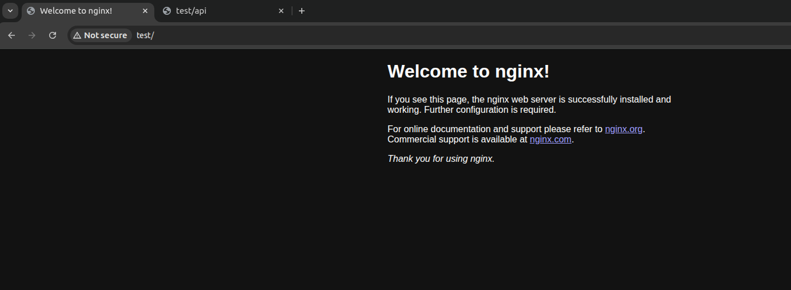
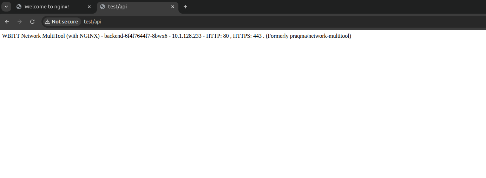

# Домашнее задание к занятию «Сетевое взаимодействие в K8S. Часть 2»

### Цель задания

В тестовой среде Kubernetes необходимо обеспечить доступ к двум приложениям снаружи кластера по разным путям.

------

### Чеклист готовности к домашнему заданию

1. Установленное k8s-решение (например, MicroK8S).
2. Установленный локальный kubectl.
3. Редактор YAML-файлов с подключённым Git-репозиторием.

------

### Инструменты и дополнительные материалы, которые пригодятся для выполнения задания

1. [Инструкция](https://microk8s.io/docs/getting-started) по установке MicroK8S.
2. [Описание](https://kubernetes.io/docs/concepts/services-networking/service/) Service.
3. [Описание](https://kubernetes.io/docs/concepts/services-networking/ingress/) Ingress.
4. [Описание](https://github.com/wbitt/Network-MultiTool) Multitool.

------

### Задание 1. Создать Deployment приложений backend и frontend

1. Создать Deployment приложения _frontend_ из образа nginx с количеством реплик 3 шт.

Файл [deploy](./deploy.yml)

2. Создать Deployment приложения _backend_ из образа multitool. 

Файл [deploy](./deploy.yml) - в том же файле

3. Добавить Service, которые обеспечат доступ к обоим приложениям внутри кластера. 

Файл [service](./service.yml)

4. Продемонстрировать, что приложения видят друг друга с помощью Service.
```
# Получаем поды и сервисы

$ kubectl -n netology get pods,svc
NAME                            READY   STATUS    RESTARTS   AGE
pod/backend-6f4f7644f7-dr76v    1/1     Running   0          2s
pod/frontend-558cdbfb74-8jcbp   1/1     Running   0          2s
pod/frontend-558cdbfb74-gvqpw   1/1     Running   0          2s
pod/frontend-558cdbfb74-pgdnd   1/1     Running   0          2s

NAME                       TYPE        CLUSTER-IP       EXTERNAL-IP   PORT(S)   AGE
service/backend-service    ClusterIP   10.152.183.174   <none>        80/TCP    2s
service/frontend-service   ClusterIP   10.152.183.103   <none>        80/TCP    2s


# Backend видит frontend

$ kubectl -n netology exec backend-6f4f7644f7-dr76v -- curl frontend-service:80 -I
  % Total    % Received % Xferd  Average Speed   Time    Time     Time  Current
                                 Dload  Upload   Total   Spent    Left  Speed
  0     0    0     0    0     0      0      0 --:--:-- --:--:-- --:--:--     0HTTP/1.1 200 OK
Server: nginx/1.27.5
Date: Tue, 27 May 2025 08:24:04 GMT
Content-Type: text/html
Content-Length: 615
Last-Modified: Wed, 16 Apr 2025 12:01:11 GMT
Connection: keep-alive
ETag: "67ff9c07-267"
Accept-Ranges: bytes

  0   615    0     0    0     0      0      0 --:--:-- --:--:-- --:--:--     0


# Frontend видит backend

$ kubectl -n netology exec frontend-558cdbfb74- -- curl backend-service:80 -I
frontend-558cdbfb74-8jcbp  frontend-558cdbfb74-gvqpw  frontend-558cdbfb74-pgdnd
akorotkov@akorotkov-vdi:~/k8s-config/homework$ kubectl -n netology exec frontend-558cdbfb74-8jcbp -- curl backend-service:80 -I
  % Total    % Received % Xferd  Average Speed   Time    Time     Time  Current
                                 Dload  Upload   Total   Spent    Left  Speed
  0   141    0     0    0     0      0      0 --:--:-- --:--:-- --:--:--     0
HTTP/1.1 200 OK
Server: nginx/1.24.0
Date: Tue, 27 May 2025 08:24:24 GMT
Content-Type: text/html
Content-Length: 141
Last-Modified: Tue, 27 May 2025 08:22:27 GMT
Connection: keep-alive
ETag: "68357643-8d"
Accept-Ranges: bytes


```
5. Предоставить манифесты Deployment и Service в решении, а также скриншоты или вывод команды п.4.

------

### Задание 2. Создать Ingress и обеспечить доступ к приложениям снаружи кластера

1. Включить Ingress-controller в MicroK8S.

Включил при помощи статьи https://microk8s.io/docs/addon-ingress
С помощью команды
```
microk8s enable ingress
```
2. Создать Ingress, обеспечивающий доступ снаружи по IP-адресу кластера MicroK8S так, чтобы при запросе только по адресу открывался _frontend_ а при добавлении /api - _backend_.

Файл [ingress](./ingress.yml)

3. Продемонстрировать доступ с помощью браузера или `curl` с локального компьютера.
>#### Подключение к test

#### Подключение к api


4. Предоставить манифесты и скриншоты или вывод команды п.2.

------

### Правила приема работы

1. Домашняя работа оформляется в своем Git-репозитории в файле README.md. Выполненное домашнее задание пришлите ссылкой на .md-файл в вашем репозитории.
2. Файл README.md должен содержать скриншоты вывода необходимых команд `kubectl` и скриншоты результатов.
3. Репозиторий должен содержать тексты манифестов или ссылки на них в файле README.md.

------
