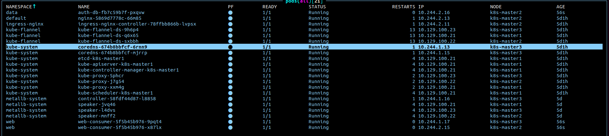

# Домашнее задание к занятию Troubleshooting

### Цель задания

Устранить неисправности при деплое приложения.

### Чеклист готовности к домашнему заданию

1. Кластер K8s.

### Задание. При деплое приложение web-consumer не может подключиться к auth-db. Необходимо это исправить

1. Установить приложение по команде:
```shell
kubectl apply -f https://raw.githubusercontent.com/netology-code/kuber-homeworks/main/3.5/files/task.yaml
```
2. Выявить проблему и описать.
3. Исправить проблему, описать, что сделано.
4. Продемонстрировать, что проблема решена.

> Первое что видим - не созданы соответсвующие неймспейсы
```
kubectl apply -f https://raw.githubusercontent.com/netology-code/kuber-homeworks/main/3.5/files/task.yaml
Error from server (NotFound): error when creating "https://raw.githubusercontent.com/netology-code/kuber-homeworks/main/3.5/files/task.yaml": namespaces "web" not found
Error from server (NotFound): error when creating "https://raw.githubusercontent.com/netology-code/kuber-homeworks/main/3.5/files/task.yaml": namespaces "data" not found
Error from server (NotFound): error when creating "https://raw.githubusercontent.com/netology-code/kuber-homeworks/main/3.5/files/task.yaml": namespaces "data" not found
```
> Создаем и пробуем снова
```
for ns in web data; do kubectl create namespace $ns; done

kubectl apply -f https://raw.githubusercontent.com/netology-code/kuber-homeworks/main/3.5/files/task.yaml
deployment.apps/web-consumer created
deployment.apps/auth-db created
service/auth-db created
```
> Все создалось, идем смотреть дальше. Видим, что все поды запущены:

> Чтобы понять что не работает необходимо изучить файл деплоя [task](./task.yaml)
> Там мы видим:
> - Первый деплоймент создает 2 реплики бизибокса, который по очереди должен курлить базу данных ```curl auth-db```
> - Второй деплоймент собственно сама БД в виде nginx
> - Сервис, который предназначен для проброса БД
> Какие проблемы видим:
> поды консумера не могут достучаться до бд, т.к. не могут разрезолвить его имя:
```
│ curl: (6) Couldn't resolve host 'auth-db'                                                                                                                                                                       │
│ curl: (6) Couldn't resolve host 'auth-db'
```
> Меняем в настройках curl на полный адрес с указанием неймспейса ```do curl auth-db.data``` и видим, что все работает
```
│ <p>If you see this page, the nginx web server is successfully installed and                                                                                                                                     │
│ working. Further configuration is required.</p>                                                                                                                                                                 │
│                                                                                                                                                                                                                 │
│ <p>For online documentation and support please refer to                                                                                                                                                         │
│ <a href="http://nginx.org/">nginx.org</a>.<br/>                                                                                                                                                                 │
│ Commercial support is available at                                                                                                                                                                              │
│ <a href="http://nginx.com/">nginx.com</a>.</p>                                                                                                                                                                  │
│                                                                                                                                                                                                                 │
│ <p><em>Thank you for using nginx.</em></p>                                                                                                                                                                      │
│ </body>                                                                                                                                                                                                         │
│ </html>                                                                                                                                                                                                         │
│   % Total    % Received % Xferd  Average Speed   Time    Time     Time  Current                                                                                                                                 │
│                                  Dload  Upload   Total   Spent    Left  Speed                                                                                                                                   │
│   0     0    0     0    0     0      0      0 --:--:-- --:--:-- --:--:--     0100   612  100   612    0     0   179k      0 --:--:-- --:--:-- --:--:--  597k                                                    │
│ <!DOCTYPE html>                                                                                                                                                                                                 │
│ <html>                                                                                                                                                                                                          │
│ <head>                                                                                                                                                                                                          │
│ <title>Welcome to nginx!</title>                                                                                                                                                                                │
│ <style>                                                                                                                                                                                                         │
│     body {                                                                                                                                                                                                      │
│         width: 35em;                                                                                                                                                                                            │
│         margin: 0 auto;                                                                                                                                                                                         │
│         font-family: Tahoma, Verdana, Arial, sans-serif;                                                                                                                                                        │
│     }                                                                                                                                                                                                           │
│ </style>                                                                                                                                                                                                        │
│ </head>                                                                                                                                                                                                         │
│ <body>                                                                                                                                                                                                          │
│ <h1>Welcome to nginx!</h1>                                                                                                                                                                                      │
│ <p>If you see this page, the nginx web server is successfully installed and                                                                                                                                     │
│ working. Further configuration is required.</p>                                                                                                                                                                 │
│                                                                                                                                                                                                                 │
│ <p>For online documentation and support please refer to                                                                                                                                                         │
│ <a href="http://nginx.org/">nginx.org</a>.<br/>                                                                                                                                                                 │
│ Commercial support is available at                                                                                                                                                                              │
│ <a href="http://nginx.com/">nginx.com</a>.</p>                                                                                                                                                                  │
│                                                                                                                                                                                                                 │
│ <p><em>Thank you for using nginx.</em></p>                                                                                                                                                                      │
│ </body>                                                                                                                                                                                                         │
│ </html>   


```
> Более ошибок не обнаружил