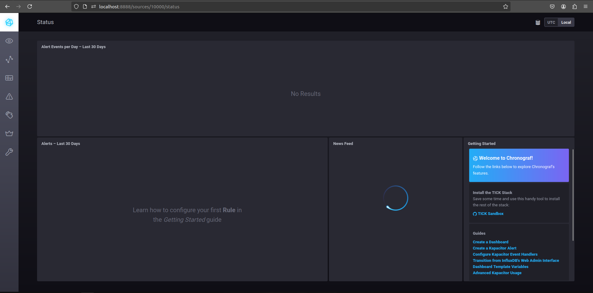
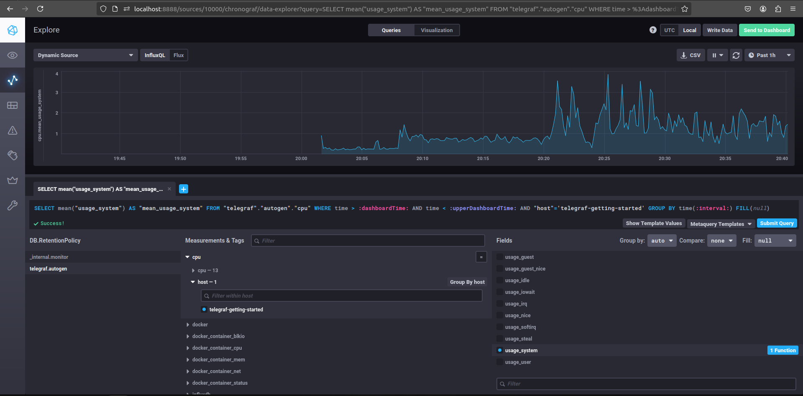
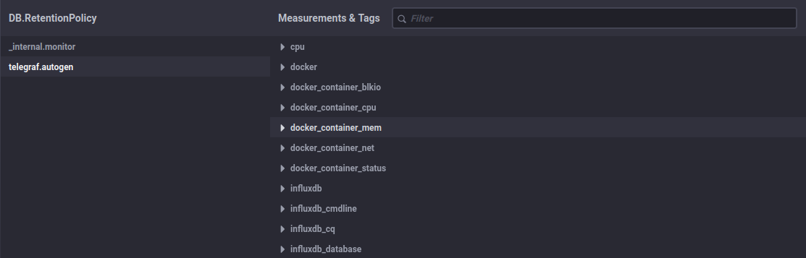

# Домашнее задание к занятию "13.Системы мониторинга"

## Обязательные задания

1. Вас пригласили настроить мониторинг на проект. На онбординге вам рассказали, что проект представляет из себя 
платформу для вычислений с выдачей текстовых отчетов, которые сохраняются на диск. Взаимодействие с платформой 
осуществляется по протоколу http. Также вам отметили, что вычисления загружают ЦПУ. Какой минимальный набор метрик вы
выведите в мониторинг и почему?

**Ответ**
Check 80 порта http - основная точка взаимодействия
RAM + CPU - Мониторинг нагрузки
Мониторинг FS - IO, место и т.д. тк у нас работа с отчетами 
Сетевые ошибки, нагрузка на сеть - опять же проверяем взаимодействие
#
2. Менеджер продукта посмотрев на ваши метрики сказал, что ему непонятно что такое RAM/inodes/CPUla. Также он сказал, 
что хочет понимать, насколько мы выполняем свои обязанности перед клиентами и какое качество обслуживания. Что вы 
можете ему предложить?

**Ответ**
RAM - загруженность оперативной памяти
inodes - загрузка файловой системы, по простому сколько еще файлов мы можем создать
CPUla - Средняя нагрузка на процессор и ядра за 15, 5 и 1 минуту. Зависит от количества ядер

Ввести Mean Time Between Failures Mean Time To Recovery
Далее SLO и SLI, определить какой у нас условный "бюджет на ошибки" (Error budget) и наконец определить с клиентом SLA.
#
3. Вашей DevOps команде в этом году не выделили финансирование на построение системы сбора логов. Разработчики в свою 
очередь хотят видеть все ошибки, которые выдают их приложения. Какое решение вы можете предпринять в этой ситуации, 
чтобы разработчики получали ошибки приложения?

**Ответ**

В зависимости от приложения.
Как вариант вшить отлов exception в приложение. Можно попробовать развернуть sentry, например если наши приложения крутятся в docker можно подселить рядом в кластер несколько контейнеров.
Можно писать логи локально, если приложение standalone и через крон парсить ошибки и отсылать на общую шару в виде файлов, файлы чистить по времени тем же кроном.
В общем очень субъективный вопрос. Может мы можем посмотреть нагрузку на ресурсы, ужать пару стейжинговых крупных виртуалок, поняв что они почти не используются и разместить там ELK.
#
4. Вы, как опытный SRE, сделали мониторинг, куда вывели отображения выполнения SLA=99% по http кодам ответов. 
Вычисляете этот параметр по следующей формуле: summ_2xx_requests/summ_all_requests. Данный параметр не поднимается выше 
70%, но при этом в вашей системе нет кодов ответа 5xx и 4xx. Где у вас ошибка?

**Ответ**

Не учтены следующие коды:
100-199 - Информационные - не являются ошибками
300-399 - Редиректы - тоже не ошибки
И те и те нужно учитывать как успешные.
#
5. Опишите основные плюсы и минусы pull и push систем мониторинга.

**Ответ**
Push-модель:

Плюсы:
1. Мгновенное оповещение: При использовании push-модели, мониторинговый агент активно отправляет данные на сервер мониторинга, что позволяет оперативно реагировать на изменения и проблемы.
2. Уменьшение нагрузки: Так как агент активно отправляет данные на сервер, это может снизить нагрузку на сервер мониторинга, так как он не нужно постоянно опрашивать агентов.
3. Простота конфигурации: Push-модель проще в настройке, так как агенты не требуют сложной конфигурации для установки.

Минусы:
1. Потеря данных: Если сервер мониторинга недоступен или происходят сетевые проблемы, данные от агентов могут быть потеряны.
2. Большая нагрузка на агентов: Активная отправка данных может создавать дополнительную нагрузку на агентах, особенно при большом количестве данных.
3. Безопасность: Push-модель может быть менее безопасной, так как агенты активно отправляют данные на сервер мониторинга.

Pull-модель:

Плюсы:
1. Надежность: При pull-модели сервер мониторинга сам запрашивает данные у агентов, что обеспечивает более надежную передачу данных.
2. Меньшая нагрузка на агентов: Агенты не отправляют данные активно, что позволяет им работать с меньшей нагрузкой.
3. Безопасность: Pull-модель может быть более безопасной, так как сервер инициирует соединение с агентами.

Минусы:
1. Задержка в обнаружении проблем: Из-за того, что сервер мониторинга опрашивает агентов, может возникнуть задержка в обнаружении проблем или изменений.
2. Увеличение нагрузки на сервер мониторинга: При большом количестве агентов или больших объемах данных, сервер мониторинга может столкнуться с увеличением нагрузки при использовании pull-модели.
3. Сложность конфигурации: Pull-модель может потребовать более сложной конфигурации для настройки опроса агентов.
#
6. Какие из ниже перечисленных систем относятся к push модели, а какие к pull? А может есть гибридные?

    - Prometheus 
    - TICK
    - Zabbix
    - VictoriaMetrics
    - Nagios

**Ответ**
Push-модель:
- Prometheus
- TICK
- VictoriaMetrics

Pull-модель:
- Zabbix
- Nagios

Гибридные:
- Grafana - может работать как с push (через Prometheus), так и с pull (через Zabbix) и даже сочетать оба метода в одной системе
#
7. Склонируйте себе [репозиторий](https://github.com/influxdata/sandbox/tree/master) и запустите TICK-стэк, 
используя технологии docker и docker-compose.

В виде решения на это упражнение приведите скриншот веб-интерфейса ПО chronograf (`http://localhost:8888`). 

P.S.: если при запуске некоторые контейнеры будут падать с ошибкой - проставьте им режим `Z`, например
`./data:/var/lib:Z`

**Ответ**

Хронограф не запускается, потому что не запускается Kapacitor, а он не запускается из-за 
```
kapacitor-1      | ts=2024-07-16T17:29:03.948Z lvl=error msg="encountered error" service=run err="create server: failed to save cluster ID: open /var/lib/kapacitor/cluster.id: permission denied"
kapacitor-1      | run: create server: failed to save cluster ID: open /var/lib/kapacitor/cluster.id: permission denied
kapacitor-1 exited with code 1
```

Upd.
Запустился 


#
8. Перейдите в веб-интерфейс Chronograf (http://localhost:8888) и откройте вкладку Data explorer.
        
    - Нажмите на кнопку Add a query
    - Изучите вывод интерфейса и выберите БД telegraf.autogen
    - В `measurments` выберите cpu->host->telegraf-getting-started, а в `fields` выберите usage_system. Внизу появится график утилизации cpu.
    - Вверху вы можете увидеть запрос, аналогичный SQL-синтаксису. Поэкспериментируйте с запросом, попробуйте изменить группировку и интервал наблюдений.

Для выполнения задания приведите скриншот с отображением метрик утилизации cpu из веб-интерфейса.


#
9. Изучите список [telegraf inputs](https://github.com/influxdata/telegraf/tree/master/plugins/inputs). 
Добавьте в конфигурацию telegraf следующий плагин - [docker](https://github.com/influxdata/telegraf/tree/master/plugins/inputs/docker):
```
[[inputs.docker]]
  endpoint = "unix:///var/run/docker.sock"
```

Дополнительно вам может потребоваться донастройка контейнера telegraf в `docker-compose.yml` дополнительного volume и 
режима privileged:
```
  telegraf:
    image: telegraf:1.4.0
    privileged: true
    volumes:
      - ./etc/telegraf.conf:/etc/telegraf/telegraf.conf:Z
      - /var/run/docker.sock:/var/run/docker.sock:Z
    links:
      - influxdb
    ports:
      - "8092:8092/udp"
      - "8094:8094"
      - "8125:8125/udp"
```

После настройке перезапустите telegraf, обновите веб интерфейс и приведите скриншотом список `measurments` в 
веб-интерфейсе базы telegraf.autogen . Там должны появиться метрики, связанные с docker.

Факультативно можете изучить какие метрики собирает telegraf после выполнения данного задания.



## Дополнительное задание (со звездочкой*) - необязательно к выполнению

1. Вы устроились на работу в стартап. На данный момент у вас нет возможности развернуть полноценную систему 
мониторинга, и вы решили самостоятельно написать простой python3-скрипт для сбора основных метрик сервера. Вы, как 
опытный системный-администратор, знаете, что системная информация сервера лежит в директории `/proc`. 
Также, вы знаете, что в системе Linux есть  планировщик задач cron, который может запускать задачи по расписанию.

Суммировав все, вы спроектировали приложение, которое:
- является python3 скриптом
- собирает метрики из папки `/proc`
- складывает метрики в файл 'YY-MM-DD-awesome-monitoring.log' в директорию /var/log 
(YY - год, MM - месяц, DD - день)
- каждый сбор метрик складывается в виде json-строки, в виде:
  + timestamp (временная метка, int, unixtimestamp)
  + metric_1 (метрика 1)
  + metric_2 (метрика 2)
  
     ...
     
  + metric_N (метрика N)
  
- сбор метрик происходит каждую 1 минуту по cron-расписанию

Для успешного выполнения задания нужно привести:

а) работающий код python3-скрипта,

б) конфигурацию cron-расписания,

в) пример верно сформированного 'YY-MM-DD-awesome-monitoring.log', имеющий не менее 5 записей,

P.S.: количество собираемых метрик должно быть не менее 4-х.
P.P.S.: по желанию можно себя не ограничивать только сбором метрик из `/proc`.

2. В веб-интерфейсе откройте вкладку `Dashboards`. Попробуйте создать свой dashboard с отображением:

    - утилизации ЦПУ
    - количества использованного RAM
    - утилизации пространства на дисках
    - количество поднятых контейнеров
    - аптайм
    - ...
    - фантазируйте)
    
    ---

### Как оформить ДЗ?

Выполненное домашнее задание пришлите ссылкой на .md-файл в вашем репозитории.

---

